.. _a1d_meshing_hypo_page:
.. |larr|   unicode:: U+02190 .. LEFTWARDS ARROW

*********************
1D Meshing Hypotheses
*********************

Basic 1D hypothesis specifies:
	* how a :ref:`Wire Discretization <a1d_algos_anchor>` should divide the edge;
	* how a :ref:`Composite Side Discretization <a1d_algos_anchor>` should divide the group of C1-continuous edges.

1D hypotheses can be categorized by type of nodes distribution as follows:
	* Uniform distribution:
    		* :ref:`Local Length <average_length_anchor>`
    		* :ref:`Max Size <max_length_anchor>`
    		* :ref:`Number of Segments <number_of_segments_anchor>` with Equidistant distribution
    		* :ref:`Automatic Length <automatic_length_anchor>`

	* Constantly increasing or decreasing length of segments:
    		* :ref:`Arithmetic Progression <arithmetic_1d_anchor>` 
    		* :ref:`Geometric Progression <geometric_1d_anchor>`
    		* :ref:`Start and end length <start_and_end_length_anchor>` 
    		* :ref:`Number of Segments <number_of_segments_anchor>` with Scale distribution

	* Distribution depending on curvature:
    		* :ref:`Adaptive <adaptive_1d_anchor>` 
    		* :ref:`Deflection <deflection_1d_anchor>` 

	* Arbitrary distribution:
    		* :ref:`Fixed Points <fixed_points_1d_anchor>` 
    		* :ref:`Number of Segments <number_of_segments_anchor>` with :ref:`Analytic Density Distribution <analyticdensity_anchor>` or Table Density Distribution

.. _adaptive_1d_anchor:

Adaptive hypothesis
###################

**Adaptive** hypothesis allows to split edges into segments with a length that depends on the curvature of edges and faces and is limited by **Min. Size** and **Max Size**. The length of a segment also depends on the lengths of adjacent segments (that can't differ more than twice) and on the  distance to close geometrical entities (edges and faces) to avoid creation of narrow 2D elements.

	.. image:: ../images/adaptive1d.png
		:align: center

* **Min size** parameter limits the minimal segment size. 
* **Max size** parameter defines the length of segments on straight edges. 
* **Deflection** parameter gives maximal distance of a segment from a curved edge.

	.. image:: ../images/adaptive1d_sample_mesh.png 
		:align: center

	.. centered::
		Adaptive hypothesis and NETGEN 2D algorithm - the size of mesh segments reflects the size of geometrical features

**See Also** a :ref:`sample TUI Script <tui_1d_adaptive>` that uses Adaptive hypothesis.

.. _arithmetic_1d_anchor:

Arithmetic Progression hypothesis
#################################

**Arithmetic Progression** hypothesis allows to split edges into segments with a length that changes in arithmetic progression (L\ :sub:`k`\  |larr| L\ :sub:`k-1`\  + d) beginning from a given starting length and up to a given end length.

The splitting direction is defined by the orientation of the underlying geometrical edge. **Reverse Edges** list box allows specifying the edges, for which the splitting should be made in the direction opposite to their orientation. This list box is usable only if a geometry object is selected for meshing. In this case it is possible to select edges to be reversed either directly picking them in the 3D viewer or by selecting the edges or groups of edges in the Object Browser. Use 
**Add** button to add the selected edges to the list.

:ref:`Helper <reversed_edges_helper_anchor>` group assists you in defining **Reversed Edges** parameter.

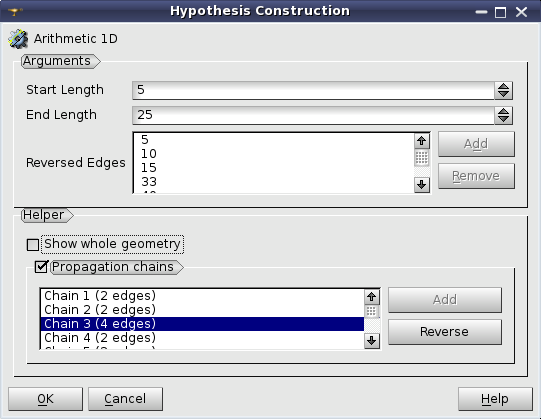

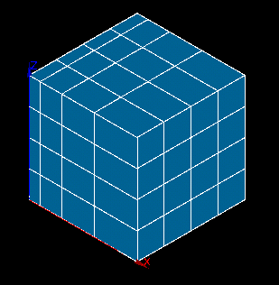

.. centered::
	Arithmetic Progression hypothesis - the size of mesh elements gradually increases

**See Also** a sample TUI Script of :ref:`Defining Arithmetic Progression and Geometric Progression hypothesis <tui_1d_arithmetic>` operation.  

.. _geometric_1d_anchor:

Geometric Progression hypothesis
################################

**Geometric Progression** hypothesis allows splitting edges into segments with a length that changes in geometric progression (L\ :sub:`k`\  |larr| L\ :sub:`k-1`\  * d) starting from a given **Start Length** and with a given **Common Ratio**.

The splitting direction is defined by the orientation of the underlying geometrical edge.
**Reverse Edges** list box allows specifying the edges, for which the splitting should be made in the direction opposite to their orientation. This list box is usable only if a geometry object is selected for meshing. In this case it is possible to select edges to be reversed either directly picking them in the 3D viewer or by selecting the edges or groups of edges in the Object Browser. Use **Add** button to add the selected edges to the list.

:ref:`Helper <reversed_edges_helper_anchor>` group assists you in defining **Reversed Edges** parameter.

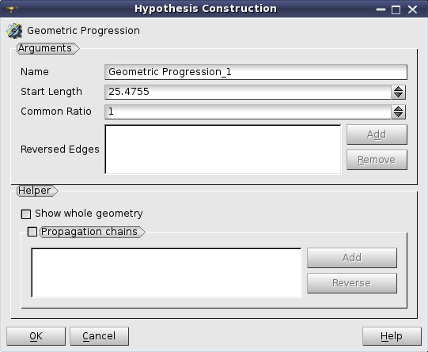

**See Also** a sample TUI Script of :ref:`Defining Arithmetic Progression and Geometric Progression hypothesis <tui_1d_arithmetic>` operation.  

.. _deflection_1d_anchor:

Deflection hypothesis
#####################

**Deflection** hypothesis can be applied for meshing curvilinear edges composing your geometrical object. It defines only one parameter: the value of deflection (or chord error).

A geometrical edge is divided into segments of length depending on edge curvature. The more curved the edge, the shorter the segment. Nodes on the edge are placed so that the maximum distance between the edge and a segment approximating a part of edge between two nodes should not exceed the value of deflection.

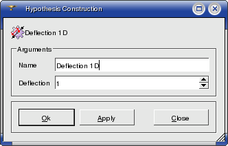

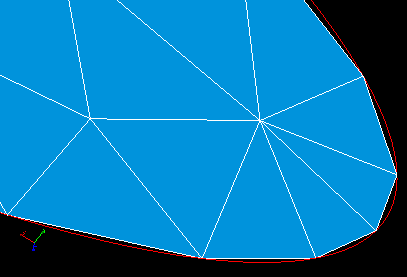

.. centered::
	Deflection hypothesis - useful for meshing curvilinear edges

**See Also** a sample TUI Script of :ref:`Defining Deflection hypothesis <tui_deflection_1d>` operation.

.. _average_length_anchor:

Local Length hypothesis
#######################

**Local Length** hypothesis can be applied for meshing of edges composing your geometrical object. Definition of this hypothesis consists of setting the **length** of segments, which will approximate these edges, and the **precision** of rounding.

The **precision** parameter is used to round a *number of segments*, calculated by dividing the *edge length* by the specified **length** of segment, to the higher integer if the *remainder* exceeds the **precision** and to the lower integer otherwise. 
Use value 0.5 to provide rounding to the nearest integer, 1.0 for the lower integer, 0.0 for the higher integer. Default value is 1e-07.

For example: if *edge length* is 10.0 and the segment **length**
is 3.0 then their division gives 10./3. = 3.33(3) and the *remainder* is 0.33(3).
If **precision** is less than 0.33(3) then the edge is divided into 3 segments.
If **precision** is more than 0.33(3) then the edge is divided into 4 segments.

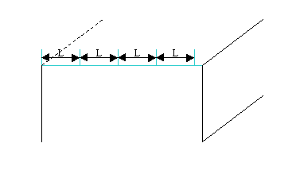

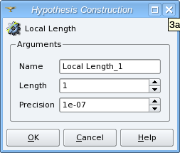

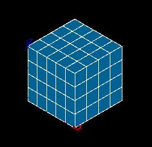

.. centered::
	Local Length hypothesis - all 1D mesh segments are equal

**See Also** a sample TUI Script of :ref:`Defining Local Length <tui_average_length>` hypothesis
operation.

.. _max_length_anchor:

Max Size
########

**Max Size** hypothesis allows splitting geometrical edges into segments not longer than the given length. Definition of this hypothesis consists of setting the maximal allowed **length** of segments.
**Use preestimated length** check box lets you use **length** automatically calculated basing on size of your geometrical object, namely as diagonal of bounding box divided by ten. The divider can be changed via :ref:`Ratio Bounding Box Diagonal / Max Size <diagonal_size_ratio_pref>` preference parameter.
**Use preestimated length** check box is enabled only if the geometrical object has been selected before hypothesis definition.

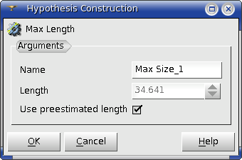

.. _number_of_segments_anchor:

Number of Segments hypothesis
#############################

**Number of Segments** hypothesis can be applied for approximating edges by a definite number of mesh segments with length depending on the selected type of distribution of nodes. The default number of segments can be set via :ref:`Automatic Parameters / Default Number of Segments <nb_segments_pref>` preference parameter.

The direction of the splitting is defined by the orientation of the underlying geometrical edge. **Reverse Edges** list box allows to specify the edges for which the splitting should be made in the direction opposing to their orientation. This list box is enabled only if the geometry object is selected for the meshing. In this case it is possible to select edges to be reversed either by directly picking them in the 3D viewer or by selecting the edges or groups of edges in the Object Browser.

:ref:`Helper <reversed_edges_helper_anchor>` group assists you in defining **Reversed Edges** parameter.

You can set the type of node distribution for this hypothesis in the **Hypothesis Construction** dialog box:

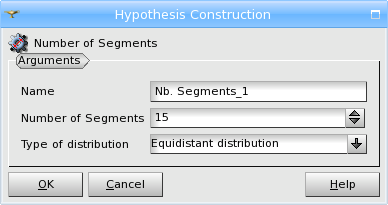

**Equidistant Distribution** - all segments will have the same length, you define only the **Number of Segments**.

**Scale Distribution** - length of segments gradually changes depending on the **Scale Factor**, which is a ratio of the first segment length to the last segment length.

Length of segments changes in geometric progression with the common ratio (A) depending on the **Scale Factor** (S) and **Number of Segments** (N) as follows: A = S\ :sup:`(1/(N-1))`\ . For an edge of length L, length of the first segment is L * (1 - A)/(1 - A\ :sup:`N`\ )

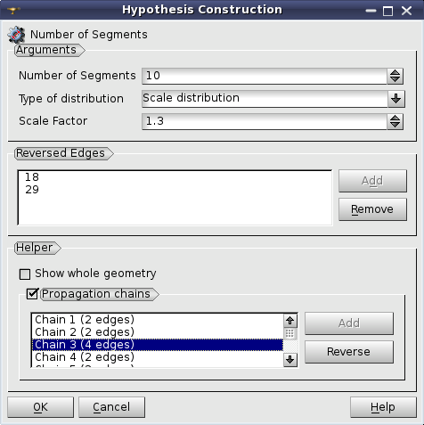

.. _analyticdensity_anchor:

**Distribution with Analytic Density** - you input the formula, which will rule the change of length of segments and the module shows in the plot the density function curve in red and the node distribution as blue crosses.

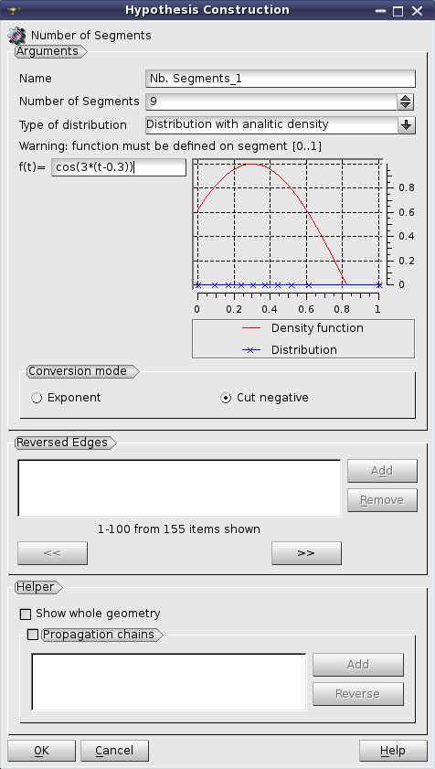

The node distribution is computed so that to have the density function integral on the range between two nodes equal for all segments.

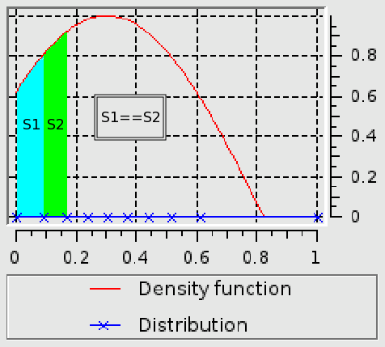

**Distribution with Table Density** - you input a number of pairs **t - F(t)**, where **t** ranges from 0 to 1, and the module computes the formula, which will rule the change of length of segments and shows in the plot the density function curve in red and the node distribution as blue crosses. The node distribution is computed in the same way as for :ref:`Distribution with Analytic Density <analyticdensity_anchor>`. You can select the **Conversion mode** from **Exponent** and **Cut negative**.

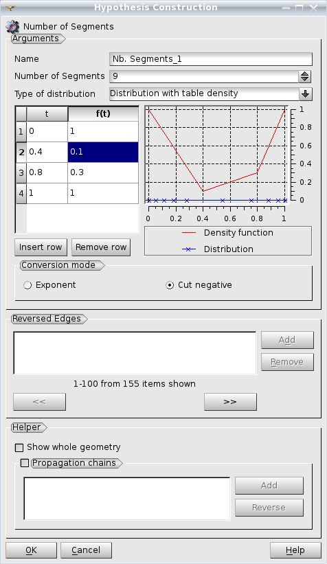

**Beta Law Distribution** - is given by the following formula (see image below) where **t** is the position of the point in the segment [0, 1].

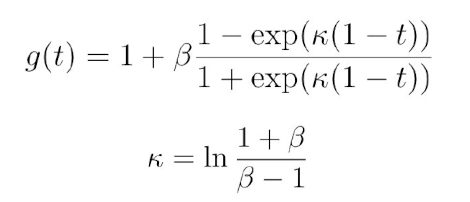

The beta parameter is usually set between 1.01 (narrow mesh) and 1.00001 (very narrow mesh). 
Values between [-1, 1] are forbidden to ensure validity of the log. 
Negative values are allowed and result with positions distributed in the opposite direction.

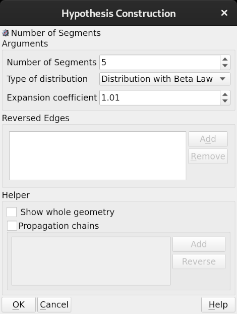

Below is an example of **Beta Law Distribution** for a face that was done using default **Expansion coefficient** value 1.01.

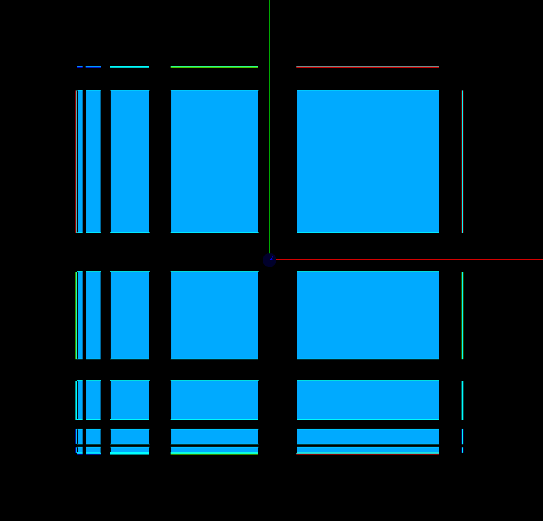

**See Also** a sample TUI Script of :ref:`Defining Number of Segments <tui_deflection_1d>` hypothesis operation.

.. note:: The plot functionality is available only if GUI module is built with Plot 2D Viewer (option SALOME_USE_PLOT2DVIEWER is ON when building GUI module).

.. _start_and_end_length_anchor:

Start and End Length hypothesis
###############################

**Start and End Length** hypothesis allows to divide a geometrical edge into segments so that the first and the last segments have a specified length. The length of medium segments changes with automatically chosen geometric progression.

The direction of the splitting is defined by the orientation of the underlying geometrical edge. **Reverse Edges** list box allows to specify the edges, for which the splitting should be made in the direction opposing to their orientation. This list box is enabled only if the geometry object is selected for the meshing. In this case it is possible to select edges to be reversed either by directly picking them in the 3D viewer or by selecting the edges or groups of edges in the Object Browser.

:ref:`Helper <reversed_edges_helper_anchor>` group assists you in defining **Reversed Edges** parameter.

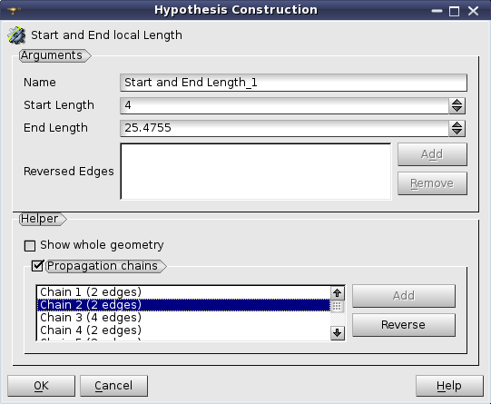

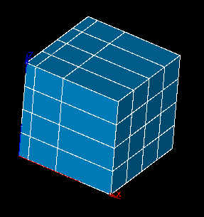

.. centered::
	 The lengths of the first and the last segment are strictly defined

**See Also** a sample TUI Script of :ref:`Defining Start and End Length <tui_start_and_end_length>` hypothesis operation.

.. _automatic_length_anchor:

Automatic Length
################

The dialog box prompts you to define the quality of the future mesh by only one parameter, which is **Fineness**, ranging from 0 (coarse mesh, low number of segments) to 1 (extremely fine mesh, great number of segments). 

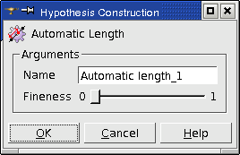

Compare one and the same object (sphere) meshed with minimum and maximum value of this parameter.

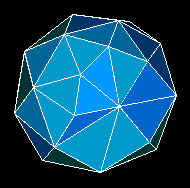
 
.. centered::
	Example of a rough mesh at Automatic Length Fineness of 0.

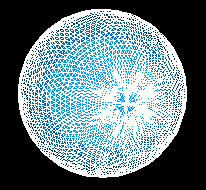
 
.. centered::
	Example of a fine mesh at Automatic Length Fineness of 1.

.. _fixed_points_1d_anchor:

Fixed Points hypothesis
#######################

**Fixed Points** hypothesis allows splitting edges through a set of points parametrized on the edge (from 1 to 0) and a number of segments for each interval limited by the points.

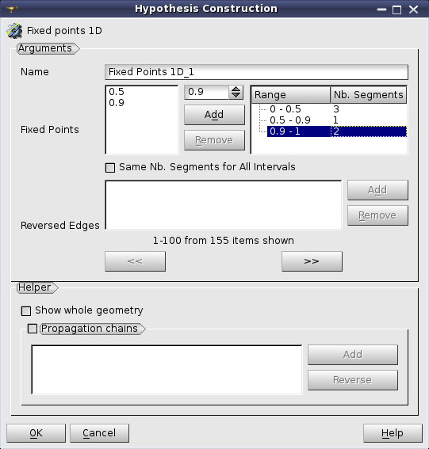

It is possible to check in **Same Nb. Segments for all intervals** option and to define one value for all intervals.

The splitting direction is defined by the orientation of the underlying geometrical edge. **Reverse Edges** list box allows to specify the edges for which the splitting should be made in the direction opposite to their orientation. This list box is enabled only if the geometrical object is selected for meshing. In this case it is possible to select the edges to be reversed either directly picking them in the 3D viewer or selecting the edges or groups of edges in the Object Browser.

:ref:`Helper <reversed_edges_helper_anchor>`  group assists in defining **Reversed Edges** parameter.

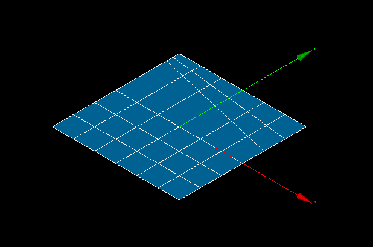

.. centered::
	Example of a sub-mesh on the edge built using Fixed Points hypothesis

**See Also** a sample TUI Script of a :ref:`Defining Fixed Points <tui_fixed_points>` hypothesis operation.

.. _reversed_edges_helper_anchor:

Reversed Edges Helper
#####################

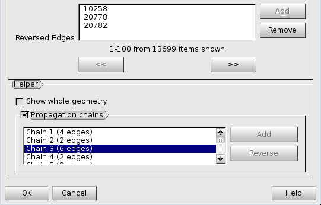

**Helper** group assists in defining **Reversed Edges** parameter of the hypotheses depending on edge direction.

**Show whole geometry** check-box allows seeing the whole geometrical model in the 3D Viewer, which can help to understand the location of a set of edges within the model.

**Propagation chains** group allows defining **Reversed Edges** for splitting opposite edges of quadrilateral faces in a logically uniform direction. When this group is activated, the list is filled with propagation chains found within the shape on which a hypothesis is assigned. When a chain is selected in the list its edges are shown in the Viewer with arrows, which enables choosing a common direction for all chain edges. **Reverse** button inverts the common direction of chain edges. **Add** button is active if some edges of a chain have a different direction, so you can click **Add** button to add them to **Reversed Edges** list.

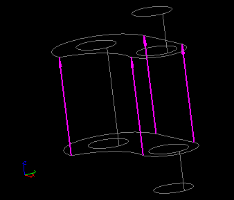

.. centered::
	The whole geometry and a propagation chain

.. note:: Alternatively, uniform direction of edges of one propagation chain can be achieved by :ref:`definition of a sub-mesh <constructing_submeshes_page>` on one edge of the chain and assigning a :ref:`Propagation <propagation_anchor>` additional hypothesis. Orientation of this edge (and hence of all the rest edges of the chain) can be controlled by using **Reversed Edges** field.

