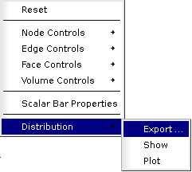

.. _quality_page: 

**********************
About quality controls
**********************

**Mesh quality control** in MESH is destined for visual control of the generated mesh.

Application of a definite quality control consists of usage of the corresponding algorithm, which calculates a value of a definite geometric characteristic (Area, Length of edges, etc) for all meshing elements, composing your mesh. Then all meshing elements are colored according the calculated values. The reference between the coloring of the meshing elements and these calculated values is shown with the help of a scalar bar, which is displayed near the presentation of your mesh.

There are four types of quality controls, corresponding to node, edge, face and volume entity type.

Node quality controls:

* :ref:`free_nodes_page`
* :ref:`double_nodes_control_page`

Edge quality controls:

* :ref:`free_borders_page`
* :ref:`length_page`
* :ref:`borders_at_multi_connection_page`
* :ref:`double_elements_page`

Face quality controls:

* :ref:`free_edges_page`
* :ref:`free_faces_page`
* :ref:`bare_border_faces_page`
* :ref:`over_constrained_faces_page`
* :ref:`length_2d_page`
* :ref:`deflection_2d_page`
* :ref:`borders_at_multi_connection_2d_page`
* :ref:`area_page`
* :ref:`taper_page`
* :ref:`aspect_ratio_page`
* :ref:`minimum_angle_page`
* :ref:`warping_page`
* :ref:`skew_page`
* :ref:`max_element_length_2d_page`
* :ref:`double_elements_page`

Volume quality controls:

* :ref:`aspect_ratio_3d_page`
* :ref:`volume_page`
* :ref:`max_element_length_3d_page`
* :ref:`bare_border_volumes_page`
* :ref:`over_constrained_volumes_page`
* :ref:`double_elements_page`

To manage the quality controls call pop-up in the VTK viewer and select "Controls" sub-menu

*  **Reset** switches off quality controls;
*  **Node Controls** provides access to the node quality controls;
*  **Edge Controls** provides access to the edge quality controls;
*  **Face Controls** provides access to the face quality controls;
*  **Volume Controls** provides access to the volume quality controls;
*  **Scalar Bar Properties** allows setting :ref:`scalar_bar_dlg`;
*  **Distribution -> Export ...** allows saving the distribution of quality control values in the text file;
*  **Distribution -> Show** Shows/Hides the distribution histogram of the quality control values in the VTK Viewer.
*  **Distribution -> Plot** Plots the distribution histogram of the quality control values in the Plot 2D Viewer.

**Table of Contents**

.. toctree::
	:maxdepth: 2

	free_nodes.rst
	double_nodes_control.rst
	free_borders.rst
	length.rst
	borders_at_multi_connection.rst
	double_elements_control.rst
	free_edges.rst
	free_faces.rst
	bare_border_face.rst
	over_constrained_faces.rst
	length_2d.rst
	deflection_2d.rst
	borders_at_multi_connection_2d.rst
	area.rst
	taper.rst
	aspect_ratio.rst
	minimum_angle.rst
	warping.rst
	skew.rst
	max_element_length_2d.rst
	aspect_ratio_3d.rst
	volume.rst
	max_element_length_3d.rst
	bare_border_volumes.rst
	over_constrained_volumes.rst
	scalar_bar.rst	
