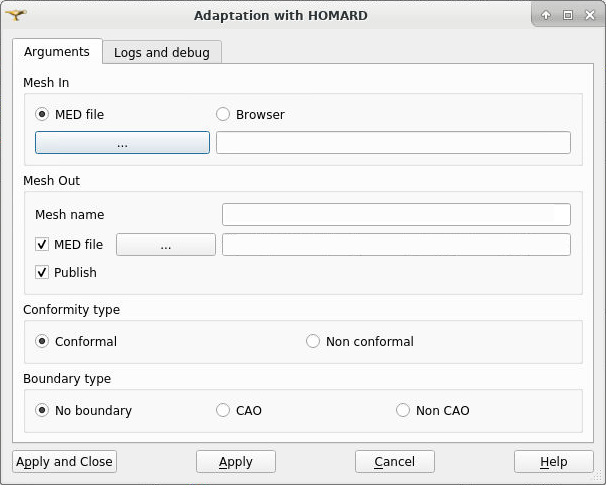
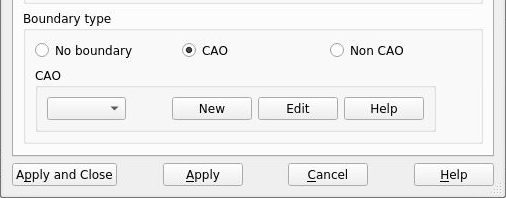
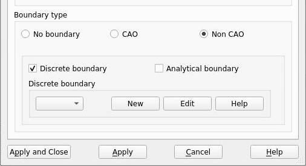
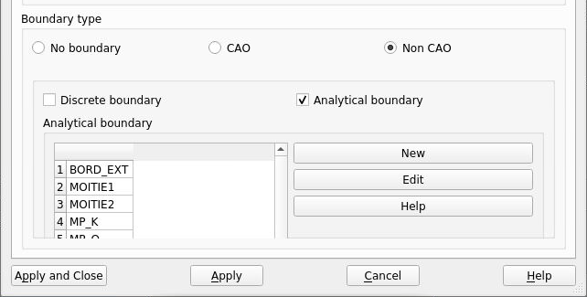
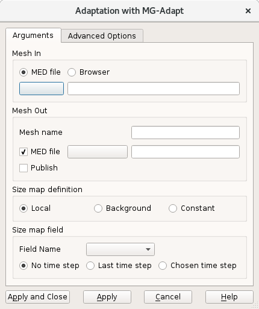
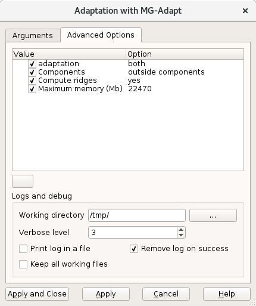

.. _adaptation_page:

**********
Adaptation
**********

Mesh module provides the possibility to perform different adaptations of a mesh.
To refine the mesh means to cut out elements indicated according to indications provided by the user.

.. _homard_adapt_anchor:

HOMARD
######

HOMARD can treat meshes into 2 or 3 dimensions and comprising the following elements:
   - mesh-points
   - segments
   - triangles
   - quadrangles
   - tetrahedra
   - hexahedra
   - prisms

These elements can be present simultaneously. For example, HOMARD will be able to adapt a comprising mesh of the triangles and the quadrangles.

To start operation, select **Remesh with HOMARD** item in **Adaptation** menu.

* **Mesh In** is the initial mesh to remesh.
* **Mesh Out** is the resulting mesh after remeshing. By default, the name of the initial mesh is kept and the file name is based on the name of the initial mesh.
* **Conformity type** is a choice between **Conformal** and **Non conformal**.
* **Boundary type** is a choice between **No boundary**, **CAO** and **Non CAO**.

- If the choice is **CAO**, a XAO file is required for each CAO boundary creation.

**See more** at :ref:`homard_create_boundary_CAO`.

- If the choice is **Non CAO**, some discrete and/or analytical boundaries can be created.

**See more** at :ref:`homard_create_boundary_Di`.

**See more** at :ref:`homard_create_boundary_An`.

.. note::
  The exhaustive description of HOMARD can be read into its documentation. It can be reached by the general help button.

**See Also** a sample TUI Script of adaptation with :ref:`tui_homard_adapt`.

.. _mg_adapt_anchor:

MG_Adapt
########

For meshes made of triangles and/or tetrahedra, remeshing operations are available with the MG-Adapt plugin. The remeshing is based on wanted mesh sizes defined over the mesh or as a constant. The boundaries are dedeuced from the initial mesh.

To start **Remeshing** operation, select **Remesh with MG_Adapt** item in **Adaptation** menu.

* **Mesh In** is the initial mesh to remesh.
* **Mesh Out** is the resulting mesh after remeshing. By default, the name of the initial mesh is kept and the file name is based on the name of the initial mesh.
* **Size map definition** is a choice between **Local**, **Background** and **Constant**.

- If the choice is **Background**, the name of the MED file must be given.
- If the choice is **Local** or **Background**, the name of the field must be selected from the list, together with time step.

.. note::
  The exhaustive description of MG-Adapt can be read into its documentation. It can be reached by the general help button.

**See Also** a sample TUI Script of :ref:`tui_adaptation_page`.
