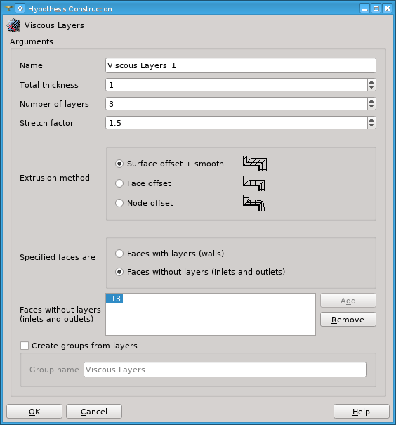
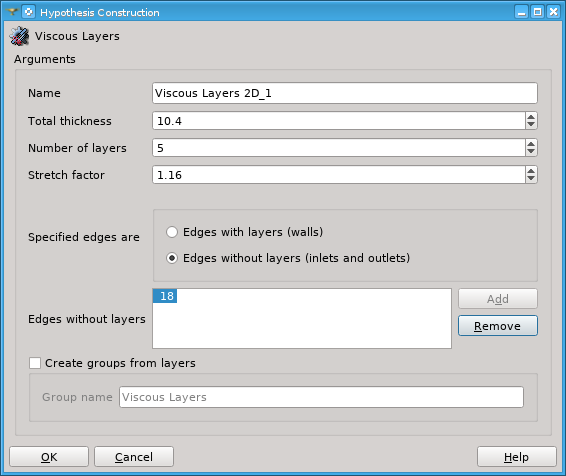
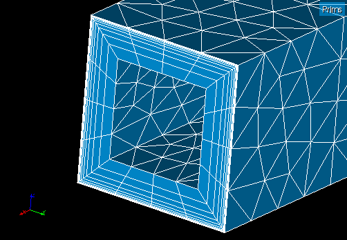

.. _additional_hypo_page: 

*********************
Additional Hypotheses
*********************

**Additional Hypotheses** can be applied as a supplement to the main hypotheses, introducing additional concepts to mesh creation.

An **Additional Hypothesis** can be defined in the same way as any main hypothesis in :ref:`Create Mesh <create_mesh_anchor>` or :ref:`Create Sub-Mesh <constructing_submeshes_page>` dialog.

The following additional hypothesis are available:
 
* :ref:`propagation_anchor` and :ref:`propagofdistribution_anchor` hypotheses are useful for creation of quadrangle and hexahedral meshes.
* :ref:`Viscous Layers <viscous_layers_anchor>` and :ref:`Viscous Layers 2D <viscous_layers_anchor>` hypotheses allow creation of layers of highly stretched elements near mesh boundary, which is beneficial for high quality viscous computations.
* :ref:`quadratic_mesh_anchor` hypothesis allows generation of second order meshes. 
* :ref:`quadrangle_preference_anchor` hypothesis enables generation of quadrangles.

.. _propagation_anchor:

Propagation of 1D Hypothesis on opposite edges
##############################################

**Propagation of 1D Hypothesis on opposite edges** allows to mesh
opposite sides of a quadrangle face and other adjacent quadrangles,
using the same hypothesis assigned to only one edge.
Thus you define a sub-mesh on the edge where you define 1D meshing
parameters and the **Propagation hypothesis**. These local meshing
parameters will be propagated via opposite sides of quadrangles to the
whole geometry, and this propagation stops at an edge with other local
meshing parameters.

This hypothesis can be taken into account by 
:ref:`Wire Discretization <a1d_algos_anchor>` and 
:ref:`Composite Side Discretization <a1d_algos_anchor>` algorithms.

**See Also** a sample TUI Script of a :ref:`Propagation hypothesis <tui_propagation>` operation

.. _propagofdistribution_anchor:

Propagation of Node Distribution on Opposite Edges
##################################################

**Propagation of Node Distribution on Opposite Edges** allows to propagate
distribution of nodes onto an opposite edge. If a local hypothesis and
propagation are defined on an edge of a quadrangular face, the
opposite edge will have the same number of nodes and the same
relations between segment lengths, unless another hypothesis
has been locally defined on the opposite edge.
 
This hypothesis can be taken into account by 
:ref:`Wire Discretization <a1d_algos_anchor>` and 
:ref:`Composite Side Discretization <a1d_algos_anchor>` algorithms.

**See Also** a sample TUI Script of a :ref:`Propagation hypothesis <tui_propagation>` operation

.. _viscous_layers_anchor:

Viscous Layers and Viscous Layers 2D
####################################

**Viscous Layers** and **Viscous Layers 2D** additional
hypotheses can be used by several 3D algorithms, for example
Hexahedron(i,j,k), or 2D algorithms, for example Triangle
(NETGEN_2D), correspondingly. These hypotheses allow creation of layers
of highly stretched elements, prisms in 3D and quadrilaterals in 2D,
near mesh boundary, which is beneficial for high quality viscous
computations.

   

* **Name** - allows to define the name of the hypothesis.
* **Total thickness** - gives the total thickness of element layers.
* **Number of layers** - defines the number of element layers.
* **Stretch factor** - defines the growth factor of element height from the mesh boundary inwards.
* **Extrusion method** (available in 3D only) - defines how positions of nodes are found during prism construction and how the creation of distorted and intersecting prisms is prevented.

  * **Surface offset + smooth** method extrudes nodes along the normal to the underlying geometrical surface. Smoothing of the internal surface of element layers is possible to avoid creation of invalid prisms.
  * **Face offset** method extrudes nodes along the average normal of surrounding mesh faces to the intersection with a neighbor mesh face translated along its own normal by the thickness of layers. The thickness of layers can be limited to avoid creation of invalid prisms.
  * **Node offset** method extrudes nodes along the average normal of surrounding mesh faces by the thickness of layers. The thickness of layers can be limited to avoid creation of invalid prisms. 

	.. image:: ../images/viscous_layers_extrusion_method.png 
		:align: center

	.. centered::
		Prisms created by the tree extrusion methods at the same other parameters

* **Specified Faces/Edges are** - defines how the shapes specified by the next parameter are used.	
* **Faces/Edges with/without layers** - defines geometrical faces or edges on which element layers either should be or should not be constructed, depending on the value of the previous parameter (**Specified Faces/Edges are**). Faces (or edges) can be selected either in the Object Browser or in the VTK Viewer. **Add** button becomes active as soon as a suitable sub-shape is selected.

  .. note:: 
	A mesh shown in the 3D Viewer can prevent selection of faces and edges, just hide the mesh to avoid this. If a face, which should be selected, is hidden by other faces, consider creating a group of faces to be selected in the Geometry module. To avoid a long wait when a geometry with many faces (or edges) is displayed, the number of faces (edges) shown at a time is limited by the value of :ref:`Sub-shapes preview chunk size <chunk_size_pref>` preference (in Preferences/Mesh/General tab).

  If faces/edges without layers are specified, the element layers are
  not constructed on geometrical faces shared by several solids in 3D
  case and edges shared by several faces in 2D case. In other words,
  in this mode the element layers can be constructed on boundary faces
  and edges only, and are not constructed on internal faces and
  edges. There is an exception to this rule: if a hypothesis is
  assigned to a sub-mesh, the element layers can be constructed on
  boundary faces/edges of the shape of this sub-mesh, at same time
  possibly being internal faces/edges within the whole model.

* **Create groups from layers** - activates creation of a group containing elements of the layers.

  .. image:: ../images/viscous_layers_on_submesh.png 
     :align: center

  .. centered::
	2D viscous layers constructed on boundary edges of a sub-mesh on a disk face.

  If you use **several** hypotheses to define viscous layers on faces of
  one solid, keep in mind the following. Each hypothesis defines a set
  of faces with viscous layers (even if you specify faces without
  layers). The sets of faces with viscous layers defined by several
  hypotheses should not intersect, else the module won't add an
  hypothesis that is incompatible with another one.
  Also you can't define different number of layers on adjacent faces
  of a solid.
  This logic is also valid for the 2D hypothesis.

.. centered::
	A group containing viscous layer prisms.

**See also** a sample TUI script of a :ref:`tui_viscous_layers`.

.. _viscous_layers_api_anchor:

Viscous Layers API
####################################

The Viscous layer API is available on TUI. Allows to compute a shrink version of the geometry. This shrank version can be passed to any mesher and be used to
build the viscous layer from the mesh computed in the shrank geometry. The current implementation only support the **Face offset** method to extrude the 
nodes from the shrank mesh to the original geometry. 

This implementation supports 3D (Solids and Solid Compound) and 2D (Face) geometries. For the 3D case, the faces Ids are
used to identify the faces (perpendicular to it) where the solid is to be reduced. For the 2D case, the edges Ids can be provided but will not have any effect
on the geometry computation (this control is not available in the opencascade library), therefore, for this case the entire face is shrank.

The Viscous Layer API receive the same parameters as the Viscous Layers Hypothesis and implements four methods:

* The constructor ``ViscousLayerBuilder()``
* The parameters definitions ``setBuilderParameters(...)``
* The ``GetShrinkGeometry()`` method that returns the shrink version of the original geometry.
* The ``AddLayers( shrinkMesh )`` method that returns the complete version of the mesh (shrink+viscous layer)

**See also** a sample TUI script of a :ref:`tui_viscous_layers_api`.

.. _quadratic_mesh_anchor:

Quadratic Mesh
##############

Quadratic Mesh hypothesis allows to build a quadratic mesh (in which
links between element nodes are not straight but curved lines due to
presence of an additional mid-side node).

This 1D hypothesis can be taken into account by 
:ref:`Wire Discretization <a1d_algos_anchor>` and 
:ref:`Composite Side Discretization <a1d_algos_anchor>` algorithms. To create a quadratic mes assign this hypothesis at 
:ref:`mesh construction <constructing_meshes_page>`.

See :ref:`adding_quadratic_elements_page` for more information about quadratic meshes.

.. _quadrangle_preference_anchor:

Quadrangle Preference
#####################

This additional hypothesis can be used together with 2D triangulation algorithms.
It allows 2D triangulation algorithms to build quadrangular meshes.

Usage of this hypothesis with :ref:`Quadrangle: Mapping <quad_ijk_algo_page>` meshing algorithm is obsolete since introducing :ref:`Quadrangle parameters <hypo_quad_params_anchor>` hypothesis.
Usage of this hypothesis with :ref:`Quadrangle: Mapping <quad_ijk_algo_page>` meshing algorithm corresponds to specifying *Quadrangle Preference* transition type of :ref:`Quadrangle parameters <hypo_quad_params_anchor>` hypothesis.

.. note::
	*Quadrangle Preference* transition type can be used only if the total quantity of segments on all sides of the face is even (divisible by 2), else *Standard* transition type is used.
