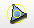

.. _aspect_ratio_3d_page:

***************
Aspect ratio 3D
***************

The **Aspect Ratio 3D** mesh quality criterion calculates the same parameter as the :ref:`aspect_ratio_page` criterion, but it is applied to 3D mesh elements: tetrahedrons, pentahedrons, hexahedrons, etc.

* The **Aspect Ratio** of a **tetrahedron** 3D element defined by vertices {a,b,c,d } is calculated by the formula:

	.. image:: ../images/formula1.png
		:align: center

* Other element types like polyhedron, pentahedron and hexahedron use the following formula:

	.. image:: ../images/formula2.png
		:align: center

*To apply the Aspect Ratio 3D quality criterion to your mesh:*

#. Display your mesh in the viewer.
#. Choose **Controls > Volume Controls > Aspect Ratio 3D** or click *"Aspect Ratio 3D"* button |img| of the toolbar.
   
   Your mesh will be displayed in the viewer with its elements colored according to the applied mesh quality control criterion:

	.. image:: ../images/image86.jpg
		:align: center

**See Also** a sample TUI Script of a :ref:`tui_aspect_ratio_3d` filter.
