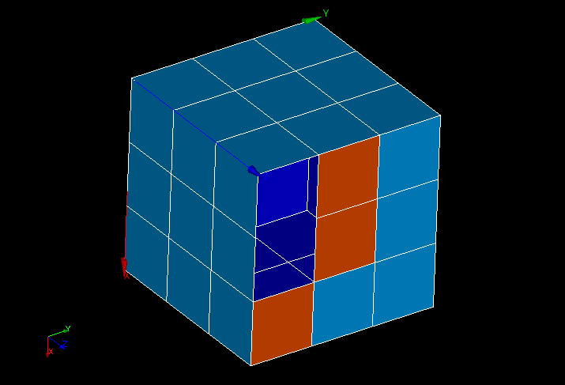

.. _bare_border_faces_page:
 
*****************
Bare border faces
*****************

This mesh quality control highlights the faces having the border not
shared with other faces (free border) and missing an edge based on
nodes of the free border. The faces with bare border are shown with a
color different from the color of shared faces.

**See also** a sample :ref:`TUI Script <tui_bare_border_faces>` making a group of faces highlighted in the picture.
