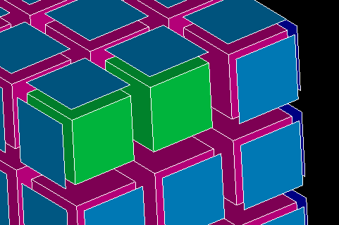

.. _bare_border_volumes_page:

*******************
Bare border volumes
*******************

This mesh quality control highlights the volumes having the border not
shared with other volumes (free border) and missing a face based on
nodes of the free border. The volumes with bare border are shown with a
color different from the color of shared volumes.

**See also** a sample :ref:`TUI Script <tui_bare_border_volumes>` making a group of volumes highlighted in the picture.

