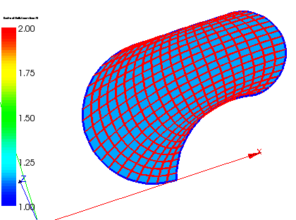

.. _borders_at_multi_connection_2d_page:

******************************
Borders at multi-connection 2D
******************************

This mesh quality control highlights borders of faces (links between nodes) according to the number of faces, to which the link belongs.

**See Also** a sample TUI Script of a :ref:`tui_borders_at_multiconnection_2d` filter.
