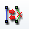

.. _convert_to_from_quadratic_mesh_page:

****************************************
Convert to/from Quadratic Mesh
****************************************

This functionality allows transforming linear meshes (or sub-meshes) to quadratic and vice versa.

.. Note::
	that conversion of a sub-mesh most probably will produce a non-conformal mesh. Elements on the boundary between quadratic and linear sub-meshes become (or remain) quadratic.

See :ref:`adding_quadratic_elements_page` for more information about quadratic meshes.

*To produce a conversion:*

#. Select a mesh or a sub-mesh in the Object Browser or in the Viewer.
#. From the Modification menu or from the contextual menu in the Object Browser choose **Convert to/from Quadratic Mesh** item, or click *"Convert to/from quadratic"* button |img| in the toolbar.

   The following dialog box will appear:

	.. image:: ../images/convert.png
		:align: center

#. In this dialog box specify:

   * If it is necessary to convert a linear mesh to quadratic or a quadratic mesh to linear. **Convert to bi-quadratic** creates some types of quadratic elements with additional central nodes: TRIA7, QUAD9 and HEXA27 elements instead of TRIA6, QUAD8, and HEXA20 elements respectively.
   * If it is necessary to place **medium nodes** of the quadratic mesh **on the geometry** (meshed shape). This option is relevant for conversion to quadratic provided that the mesh is based on a geometry (not imported from file).

		.. image:: ../images/image156.gif
			:align: center

		.. centered::
			Linear mesh (coarse mesh on a torus)

		.. image:: ../images/image155.gif
			:align: center

		.. centered::
			Quadratic mesh

#. Click the **Apply** or **Apply and Close** button.

**See Also** a sample TUI Script of a :ref:`tui_quadratic` operation.

