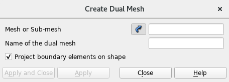

.. _create_dual_mesh_page:

****************
Create Dual Mesh
****************

We can create the dual of a Tetrahedron Mesh which will be a polyhedron mesh.
The Mesh is created using MEDCoupling computeDualMesh function.

*To create a dual mesh:*

From the contextual menu in the Object Browser of from the **Mesh** menu select
**Create Dual Mesh** or click *"Create Dual Mesh"* button |img| in the toolbar.

The following dialog box will appear:

In the dialog:

* specify the mesh for which to create the dual mesh:
  * **Select whole mesh** from the study tree. If a mesh was selected before calling function it will be preselected.
  * If the mesh is not made of only Tetrahedrons a error message will be displayed and you won't be allowed to go through.
* specify the **New Mesh Name**;
* activate **Project boundary elements on shape** for the boundary points of the
  dual mesh to be projected on their associated shape.

* Click **Apply** or **Apply and Close** button to confirm the operation.

----------------------------
Limitations of the dual mesh
----------------------------

Only 2d groups will be transferred to the dual mesh.

If you have convex shape the projection might not improve the mesh.

**See Also** a sample script of :ref:`tui_create_dual_mesh`.
