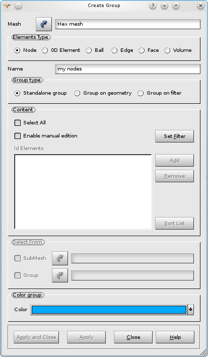
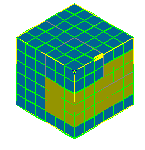
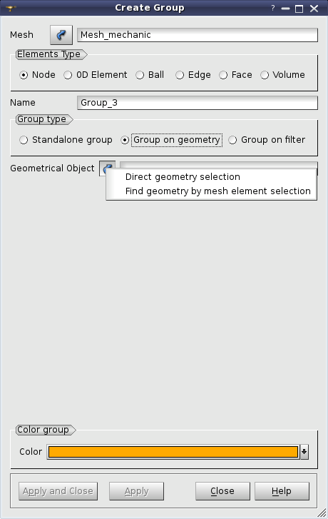
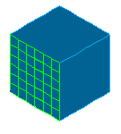

.. _creating_groups_page:

***************
Creating groups
***************

In MESH you can create a group of elements of a certain type. The main way to create a group, is to
select in the **Mesh** menu **Create Group** item (also available in the context menu of the mesh).
To create a group you should define the following:

* **Mesh** - the mesh whose elements will form your group. You can select your mesh in the Object Browser or in the 3D viewer.
* **Elements Type** - set of radio buttons allows to select the type of elements which will form your group:
	* **Nodes**
	* **0D Element**
	* **Ball**
	* **Edges**
	* **Faces**
	* **Volumes**
* **Name** field allows to enter the name of your new group.
* **Color** - allows to assign to the group a certain color. The chosen color is used to display the elements of the group. Activation of **Auto Color** item in mesh context menu switches on a random choice of a color for a new group.

Mesh module distinguishes between the three Group types:
**Standalone Group**, **Group on Geometry** and **Group on Filter**.

.. _standalone_group:

"Standalone Group"
##################

**Standalone Group** contains a list of mesh elements, which you can define in
the following ways:

* By adding all entities of the chosen type existing in the mesh. For this, turn on the **Select All** check-box. In this mode all controls, which allow selecting the entities, are disabled.
* By choosing entities manually with the mouse in the 3D Viewer. For this, turn on the **Enable manual edition** check box. You can click on an element in the 3D viewer and it will be highlighted. After that click the **Add** button and the ID of this element will be added to the list. The **Set filter** button allows to define the filter for selection of the elements for your group. See more about filters on the :ref:`selection_filter_library_page` page.
* By adding entities from either a sub-mesh or another group. For this, turn on the **Enable manual edition** check box. **Select from** fields group allows to select a sub-mesh or a group of the appropriate type and to **Add** their elements to the group.

In the **manual edition** mode you can

* click the **Remove** button to remove the selected items from the list.
* click the **Sort List** button to sort the list of IDs of mesh elements.

For example, to create a new group containing all faces of an existing group and some other faces selected in the viewer:

* Select the **Face** type of entities and input the name of the new group.
* Check the **Group** checkbox in **Select From** group.
* Select the existing group of faces in the object browser or in the viewer.
* Click **Add** in **Content** group. **Id Elements** list will be filled with IDs of faces belonging to the selected group.
* Select other faces in the viewer.
* Click **Add** in **Content** group.
* Click **Apply** button to create the new group.

.. note:: The new group does not have references to the source group. It contains only the list of face IDs. So if the source group is changed, the new one is not updated accordingly.

.. centered::
	Brown cells belong to a group defined manually

**See Also** a sample TUI Script of a :ref:`tui_create_standalone_group` operation.

.. _group_on_geom:

"Group on Geometry"
###################

.. |sel| image:: ../images/image120.png

To create a group on geometry check **Group on geometry** in the **Group** **type** field. The group on geometry contains the elements of a certain type generated on the selected geometrical object. Group contents are dynamically updated if the mesh is modified. The group on geometry can be created only if the mesh is based on geometry.

To define a group, click the *Selection* button |sel| and choose

* *Direct geometry selection* to select a shape in the Object Browser or in the Viewer;
* *Find geometry by mesh element selection* to activate a dialog which retrieves a shape by the selected element generated on this shape.

.. note::
	This choice is available only if the mesh elements are already generated.

After confirmation of the operation a new group of mesh elements will be created.

.. centered::
   Cells belonging to a certain geometrical face are selected in green

**See Also** a sample TUI Script of a  :ref:`tui_create_group_on_geometry` operation.

.. _group_on_filter:

"Group on Filter"
#################

To create a group on filter check **Group on filter** in the **Group type** field.
The group on filter contains the elements of a certain type satisfying the defined filter.
Group contents are dynamically updated if the mesh is modified.

To define a group, click the **Set filter** button and define criteria of the filter in the opened dialog. After the operation is confirmed, a new group of mesh elements will be created. See more about filters on the :ref:`selection_filter_library_page` page.

	.. image:: ../images/creategroup_on_filter.png
		:align: center

**See Also** a sample TUI Script of a :ref:`tui_create_group_on_filter` operation.
