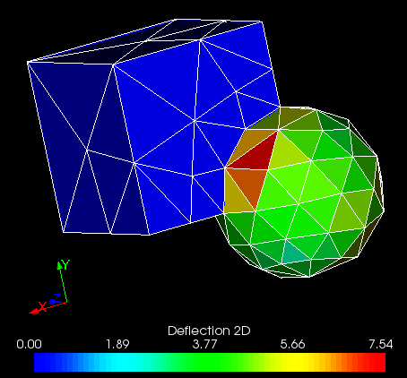

.. _deflection_2d_page:

*************
Deflection 2D
*************

This quality control criterion consists of calculation of distance between a mesh face gravity corner
and the surface the face discretizes.

*To apply the Deflection 2D quality criterion to your mesh:*

#. Display your mesh in the viewer.
#. Choose **Controls > Face Controls > Deflection 2D** or click *"Deflection 2D"* |img| button in the toolbar. 

Your mesh will be displayed in the viewer with faces colored according to the applied mesh quality control criterion:

**See Also** a sample TUI Script of a :ref:`tui_deflection_2d` operation.  
