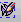

.. _editing_groups_page:

**************
Editing groups
**************

*To edit an existing group of elements:*

#. Select your group in the Object Browser and in the **Mesh** menu click the **Edit Group** item or *"Edit Group"* button |img| in the toolbar.

   The following dialog box will appear for **standalone group**:

	.. image:: ../images/editgroup.png
		:align: center

   In this dialog box you can modify the name and the color of your group. And you can add or remove the elements composing the group.

   The following dialog box will appear for **group on geometry**:

	.. image:: ../images/editgroup_on_geom.png
		:align: center

   In this dialog box you can modify only the name and the color of your group.

   The following dialog box will appear for **group on filter**:

	.. image:: ../images/editgroup_on_filter.png
		:align: center

   In this dialog box you can modify the name, the color and the criteria of the filter of your group.

   For more information see :ref:`creating_groups_page` page.

#. Click the **Apply** or **Apply and Close** button to confirm modification of the group.

.. _convert_to_standalone:

Convert to standalone group
===========================

*To convert an existing group on geometry or a group on filer into a standalone group and modify its contents:*

#. Select your group on geometry or on filter in the Object Browser and in the **Mesh** menu click the **Edit Group as Standalone** item |edit|.

   The selected group will be converted into a standalone group and its contents can be modified.

#. Click the **Apply** or **Apply and Close** button to confirm modification of the group.

**See also:** A sample TUI Script of an :ref:`tui_edit_group` operation.  

