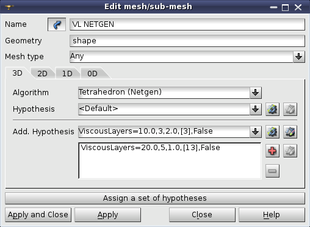
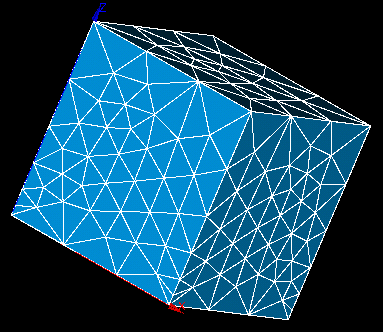
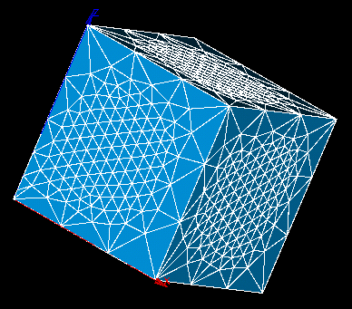

.. _editing_meshes_page:

**************
Editing Meshes
**************

After you have created a mesh or sub-mesh with definite applied meshing algorithms and hypotheses you can edit your mesh by **assigning** other algorithms and/or hypotheses or **unassigning** the applied hypotheses and algorithms. The editing proceeds in the same way as 
:ref:`Mesh Creation <create_mesh_anchor>`.

You can also change values for the current hypothesis by clicking the
*"Edit Hypothesis"* |img| button.

Mesh entities generated before using changed hypotheses are automatically removed.

See how the mesh constructed on a geometrical object
changes if we apply different meshing parameters to it.

.. centered::
	 Example of a mesh with Max. Element area 2D hypothesis roughly corresponding to 1D hypotheses on edges

.. centered::
	And now the Max Element area is greatly reduced

**See Also** a sample TUI Script of an :ref:`Edit Mesh <tui_editing_mesh>` operation.  

