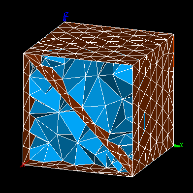

.. _free_faces_page:

**********
Free faces
**********

This mesh quality control highlights the faces connected to less than two mesh volume elements. The free faces are shown with a color different from the color of shared faces.

In this picture some volume mesh elements have been removed, as a result some faces became connected only to one volume. i.e. became free.

**See also:** A sample TUI Script of a :ref:`tui_free_faces` filter.
