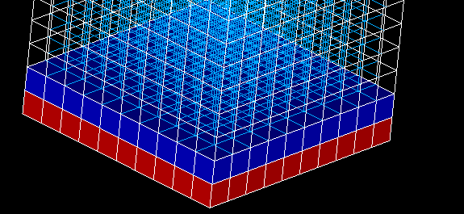

.. _group_of_underlying_elements_page:

************************************
Group Based on Nodes of Other Groups
************************************

To create a standalone group of entities basing on nodes of existing reference groups, in the **Mesh** menu select **Group based on nodes of other groups**.

The following dialog box will appear:

In this dialog box specify 

	* the resulting **Group name**, 
	* the **Elements Type** of entities of the resulting group,
	* the criterion of inclusion of a mesh entity to the result group, which is **Number of common nodes** of the entity and the reference groups: 
		* **All** - include if all nodes are common;
		* **Main** - include if all corner nodes are common (meaningful for a quadratic mesh) 
		* **At least one** - include if one or more nodes are common
		* **Majority** - include if half or more nodes are common
  
	* select reference groups,
	* If **Include underlying entities only** option is activated an entity can be included if it is based on nodes of one element of a reference group.

In the figure below, there are two reference Volume groups:

.. centered:: 
	Reference groups

In this case the following results for Faces, Edges and Nodes are obtained:

.. centered::
	Faces

.. centered::
	Edges

.. centered::
	Nodes

**See Also** a sample TUI Script of a :ref:`tui_create_dim_group` operation.

