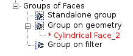

.. _grouping_elements_page:

*****************
Grouping elements
*****************

In Mesh module it is possible to create groups of mesh entities: nodes, edges, faces, volumes, 0D elements or balls. One group contains elements of only one type. Groups, unlike sub-meshes, are exported along with mesh entities into the files of following formats: MED, UNV, and CGNS. The group has a color attribute which is used for visualization only and is not exported.

There are three types of groups different by their internal organization:

#. **Standalone group** is a static set of mesh entities. Its contents can be explicitly controlled by the user. Upon removal of the entities included into the group, e.g. due to modification of  meshing parameter, the group becomes empty and its content can be restored only manually. Hence it is reasonable to create standalone groups when the mesh generation is finished and mesh quality is verified.
	.. warning:: Creation and edition of large standalone groups in :ref:`Create group <creating_groups_page>` dialog using manual edition is problematic due to poor performance of the dialog.
  
#. **Group on geometry** is associated to a sub-shape or a group of sub-shapes of the main shape and includes mesh entities generated on these geometrical entities. The association to a geometry is established at group construction and cannot be changed. The group contents are always updated automatically, hence the group can be created even before mesh elements generation.

#. **Group on filter** encapsulates a :ref:`filter <filters_page>`, which is used to select mesh entities composing the group from the whole mesh. Criteria of the filter can be changed at any time. The group contents are always updated automatically, hence the group can be created even before mesh elements generation.

The group on geometry and group on filter can be converted to a standalone group.

.. centered::
	Groups of different types look differently in the Object Browser

The following ways of group creation are possible:

* :ref:`Create group <creating_groups_page>` dialog allows creation of a group of any type: :ref:`Standalone group<standalone_group>`, :ref:`Group on geometry <group_on_geom>` and :ref:`Group on filter <group_on_filter>` using dedicated tabs.
* :ref:`Create Groups from Geometry <create_groups_from_geometry_page>` dialog allows creation of several groups on geometry at once.
* :doc:`face_groups_by_sharp_edges` operation distributes all faces of the mesh among groups using sharp edges and/or existing 1D elements as group boundaries.
* Standalone groups of all nodes and elements of the chosen sub-mesh (type of elements depends on dimension of sub-mesh geometry) can be created using **Mesh -> Construct Group** menu item (available from the context menu as well).
* Standalone groups of any element type can be created basing on nodes of other groups - using :ref:`Group based on nodes of other groups <group_of_underlying_elements_page>` dialog.
* Standalone groups can be created by applying :ref:`Boolean operations <using_operations_on_groups_page>` to other groups.
* Creation of standalone groups is an option of many :ref:`mesh modification <modifying_meshes_page>` operations.

The created groups can be later:

* :ref:`Edited <editing_groups_page>`
* :ref:`Deleted <deleting_groups_page>`, either as an object or together with contained elements.
* The group on geometry and group on filter can be :ref:`converted into the standalone <convert_to_standalone>` group.
* :ref:`Exported <importing_exporting_meshes_page>` into a file as a whole mesh.

In the Object Browser, if an item contains more than one child group, it is possible to sort the groups by name in ascending order using **Sort children** context menu item. 

.. centered::
	Sorting groups

An important tool, providing filters for creation of standalone groups and groups on filter is :ref:`selection_filter_library_page`.

**See Also** sample TUI Scripts of :doc:`tui_grouping_elements` operations.

**Table of Contents**

.. toctree::
	:maxdepth: 2

	creating_groups.rst
	create_groups_from_geometry.rst
	face_groups_by_sharp_edges.rst
	group_of_underlying_elements.rst
	using_operations_on_groups.rst
	editing_groups.rst
	deleting_groups.rst
