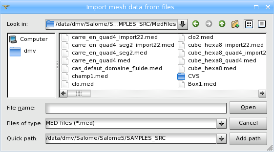
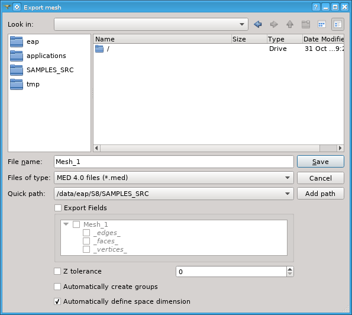
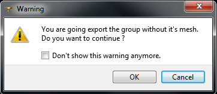

.. _importing_exporting_meshes_page:

******************************
Importing and exporting meshes
******************************

==============================
File formats
==============================

In MESH there is a functionality allowing import/export of meshes in the following formats:

* **MED**,
* **UNV** (I-DEAS 10),
* **STL**, 
* **CGNS**,
* **GMF** (internal format of DISTENE products from the MeshGems suite),
* **DAT** (simple ascii format).

You can also export a group as a whole mesh.

------------------------------
Additional file formats with meshio
------------------------------

It is possible to use additional file formats using **meshio** library.
However, there are some restrictions because of way it uses in Salome. The main points here are:

* We use intermediate MED file to communicate between Salome and **meshio**.
* Conversion to the target format performs **meshio convert** command, using given **MED** file.
* Current **meshio** version doesn't work well with all tested file formats. 

Anyway, you can try to import/export meshes with **meshio** using following formats:

* Abaqus (*.inp)
* ANSYS msh (*.msh)
* AVS-UCD (*.avs)
* CGNS (*.cgns)
* DOLFIN XML (*.xml)
* Exodus (*.e *.exo)
* FLAC3D (*.f3grid)
* Gmsh 2.2, 4.0, and 4.1 (*.msh)
* H5M (*.h5m)
* Kratos/MDPA (*.mdpa)
* MED/Salome (*.med)
* Medit (*.mesh *.meshb)
* Nastran (*.bdf *fem *.nas)
* Netgen(*.vol *.vol.gz)
* OBJ (*.obj)
* OFF (*.off)
* PERMAS (*.post *.post.gz *.dato *.dato.gz)
* PLY (*.ply)
* STL (*.stl)
* SU2 (*.su2)
* SVG, 2D output only (*.svg)
* Tecplot (*.dat)
* TetGen (*.node *.ele)
* UGRID (*.ugrid)
* VTK (*.vtk)
* VTU (*.vtu)
* WKT, TIN (*.wkt)
* XDMF (*.xdmf *.xmf)

==============================
Import
==============================

*To import a mesh:*

#. From the **File** menu choose the **Import** item, from its sub-menu select the corresponding format (MED, UNV, STL, GMF and CGNS) of the file containing your mesh.
#. In the standard **Search File** dialog box find the file for import. It is possible to select multiple files to be imported all at once.  
#. Click the **OK** button.

==============================
Export
==============================

*To export a mesh or a group:*

#. Select the object you wish to export.
#. From the **File** menu choose the **Export** item, from its sub-menu select the format (MED, UNV, DAT, STL, GMF and CGNS) of the file which will contain your exported mesh.
#. In the standard **Search File** select a location for the exported file and enter its name.
#. Click the **OK** button.

If you try to export a group, the warning will be shown:

* **Don't show this warning anymore** check-box allows to switch off the warning. You can re-activate the warning in :ref:`Preferences <group_export_warning_pref>`.

Only MED format supports all types of elements that can be created in the module. If you export a mesh or group that includes elements of types that are not supported by chosen format, you will be warned about that.

There are additional parameters available at export to MED format files.

.. _export_auto_groups:

* **Z tolerance** field if enabled specifies distance of nodes from the XOY plane below which the nodes snap to this plane. A default value can be set in :ref:`Preferences <medexport_z_tolerance_pref>`.
* **Automatically create groups** check-box specifies whether to create groups of all mesh entities of available dimensions or not. The created groups have names like "Group_On_All_Nodes", "Group_On_All_Faces", etc. A default state of this check-box can be set in :ref:`Preferences <export_auto_groups_pref>`.
* **Automatically define space dimension** check-box specifies whether to define space dimension for export by mesh configuration or not. Usually the mesh is exported as a mesh in 3D space, just as it is in Mesh module. The mesh can be exported as a mesh of a lower dimension in the following cases, provided that this check-box is checked:

  * **1D**: if all mesh nodes lie on OX coordinate axis. 
  * **2D**: if all mesh nodes lie in XOY coordinate plane. 

* :ref:`Save cell/node numbers to MED file <med_export_numbers_pref>` preference controls whether node and cell numbers are saved.

**See Also** a sample TUI Script of an :ref:`Export Mesh <tui_export_mesh>` operation.

