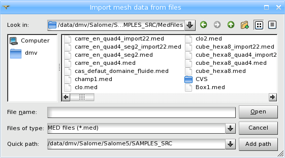
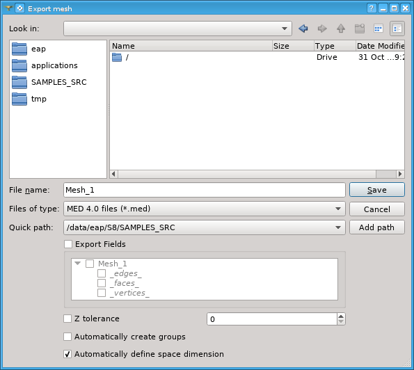
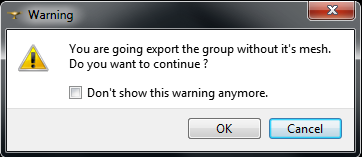

.. _importing_exporting_meshes_page:

******************************
Importing and exporting meshes
******************************

==============================
File formats
==============================

In MESH there is a functionality allowing import/export of meshes in the following formats:

* **MED**,
* **UNV** (I-DEAS 10),
* **STL**, 
* **CGNS**,
* **GMF** (internal format of DISTENE products from the MeshGems suite),
* **DAT** (simple ascii format).

You can also export a group as a whole mesh.

------------------------------
Additional file formats with **GMSH**
------------------------------

It is possible to use additional file formats using **GMSH** backend with the following approach:

* The mesh is first saved in a temporary MED file.
* The MED file is then read by **GMSH** and converted to the desired file format using ``--format`` option.

Following formats are currently supported:

* Gmsh 4.1 (*.msh)
* Gmsh 2.2 (*.msh)
* MAIL (*.mail)
* Abaqus (*.inp)
* MED/Salome (*.med)
* Medit MESH (*.mesh)
* Nastran (*.bdf)
* OBJ (*.obj)
* OFF (*.off)
* PLY (*.ply)
* STL (*.stl)
* SU2 (*.su2)
* Tecplot (*.tec)
* VTK (*.vtk)

**WARNING**: Due to limitations in the Gmsh 2.2 format, groups will be automatically created by dimension to export the various elements (Group_Of_All_Edges, Group_Of_All_Faces, Group_Of_All_Volumes).

------------------------------
Additional file formats with **MeshIO**
------------------------------

It is also possible to use additional file formats using **MeshIO** library:

* The mesh is first saved in a temporary MED file.
* The MED file is then read by **MeshIO** and converted to the desired file formatusing ``--output-format`` option.

The following formats are currently supported:

* ANSYS msh (*.msh)
* AVS-UCD (*.avs)
* DOLFIN XML (*.xml)
* Exodus (*.e)
* Exodus (*.exo)
* FLAC3D (*.f3grid)
* H5M (*.h5m)
* Kratos/MDPA (*.mdpa)
* Medit MESHB (*.meshb)
* Nastran (*.fem)
* Nastran (*.nas)
* Netgen (*.vol)
* Netgen (*.vol.gz)
* PERMAS (*.post)
* PERMAS (*.dato)
* SVG, 2D output only (*.svg)
* TetGen (*.node)
* TetGen (*.ele)
* UGRID (*.ugrid)
* VTU (*.vtu)
* WKT, TIN (*.wkt)
* XDMF (*.xdmf)
* XDMF (*.xmf)

==============================
Import
==============================

*To import a mesh:*

#. From the **File** menu choose the **Import** item, from its sub-menu select the corresponding format (MED, UNV, STL, GMF and CGNS) of the file containing your mesh.
#. In the standard **Search File** dialog box find the file for import. It is possible to select multiple files to be imported all at once.  
#. Click the **OK** button.

==============================
Export
==============================

*To export a mesh or a group:*

#. Select the object you wish to export.
#. From the **File** menu choose the **Export** item, from its sub-menu select the format (MED, UNV, DAT, STL, GMF and CGNS) of the file which will contain your exported mesh.
#. In the standard **Search File** select a location for the exported file and enter its name.
#. Click the **OK** button.

If you try to export a group, the warning will be shown:

* **Don't show this warning anymore** check-box allows to switch off the warning. You can re-activate the warning in :ref:`Preferences <group_export_warning_pref>`.

Only MED format supports all types of elements that can be created in the module. If you export a mesh or group that includes elements of types that are not supported by chosen format, you will be warned about that.

There are additional parameters available at export to MED format files.

.. _export_auto_groups:

* **Z tolerance** field if enabled specifies distance of nodes from the XOY plane below which the nodes snap to this plane. A default value can be set in :ref:`Preferences <medexport_z_tolerance_pref>`.
* **Automatically create groups** check-box specifies whether to create groups of all mesh entities of available dimensions or not. The created groups have names like "Group_On_All_Nodes", "Group_On_All_Faces", etc. A default state of this check-box can be set in :ref:`Preferences <export_auto_groups_pref>`.
* **Automatically define space dimension** check-box specifies whether to define space dimension for export by mesh configuration or not. Usually the mesh is exported as a mesh in 3D space, just as it is in Mesh module. The mesh can be exported as a mesh of a lower dimension in the following cases, provided that this check-box is checked:

  * **1D**: if all mesh nodes lie on OX coordinate axis. 
  * **2D**: if all mesh nodes lie in XOY coordinate plane. 

* :ref:`Save cell/node numbers to MED file <med_export_numbers_pref>` preference controls whether node and cell numbers are saved.

**See Also** a sample TUI Script of an :ref:`Export Mesh <tui_export_mesh>` operation.

