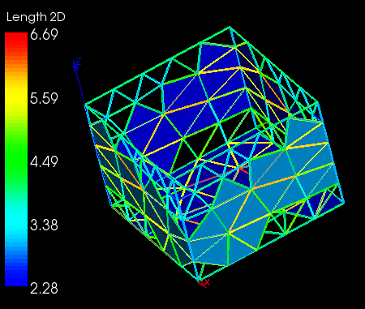

.. _length_2d_page:

*********
Length 2D
*********

This quality control criterion consists of calculation of length of the links between corner nodes of mesh faces.

*To apply the Length 2D quality criterion to your mesh:*

#. Display your mesh in the viewer. 
#. Choose **Controls > Face Controls > Length 2D** or click *"Length 2D"* button |img| in the toolbar. 

Your mesh will be displayed in the viewer with links colored according to the applied mesh quality control criterion:

**See Also** a sample TUI Script of a :ref:`tui_length_2d` filter.
