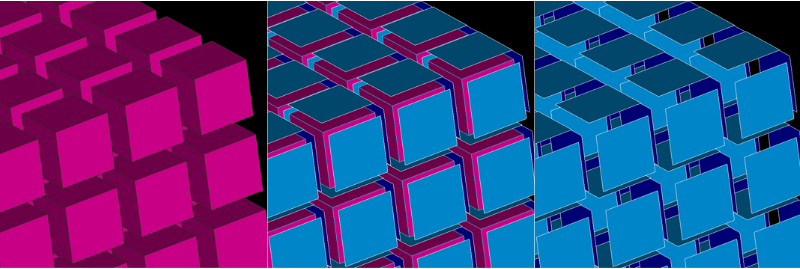

.. _make_2dmesh_from_3d_elements_page:

**************************
Generate 2D mesh from 3D elements
**************************

This functionality allows to generate 2D mesh elements from the 3D elements in the mesh.

.. centered::
	2D mesh created from the 3D elements

*To generate 2D elements:*

#. Select a mesh or group in the Object Browser or in the 3D Viewer
#. From the **Modification** menu choose **Create 2D mesh from 3D** item, or click "Create 2D mesh from 3D" button |img| in the toolbar

   The following dialog box will appear:

	.. image:: ../images/2d_mesh_from_3d_elements_dlg.png	
		:align: center

	.. centered::
		 Create 2D mesh from 3D elements dialog box

#. Click the **Apply** or **Apply and Close** button to perform the operation.

In this dialog:

* specify the **Target** mesh, where the boundary elements will be created.
  
	* **This mesh** adds elements in the selected mesh.
	* **New mesh** adds elements to a new mesh. The new mesh appears in the Object Browser with the name that you can change in the adjacent box. 
  
* activate **Copy source mesh** checkbox to copy all elements of the selected mesh to the new mesh, else the new mesh will contain only 2D elements (old and created by this operation).
* activate **Create group** checkbox to create a group to which all the 2D elements (old and new) are added. The new group appears in the Object Browser with the name that you can change in the adjacent box. 

**See Also** a sample TUI Script of a :ref:`tui_make_2dmesh_from_3d_elements` operation.  

