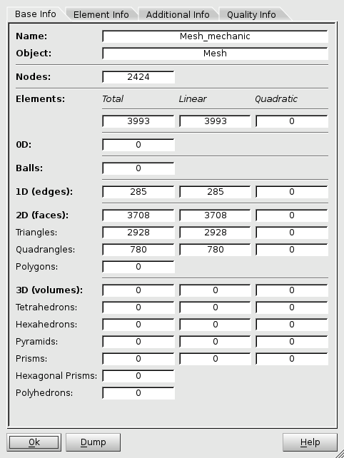
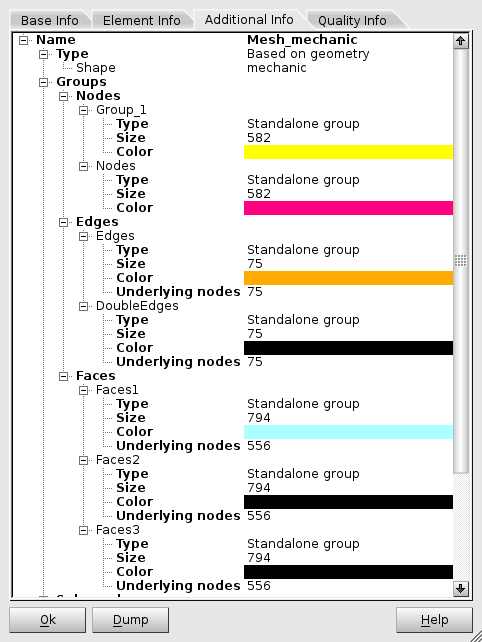
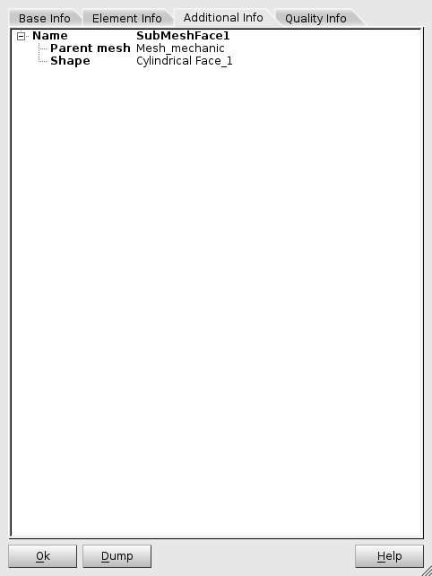
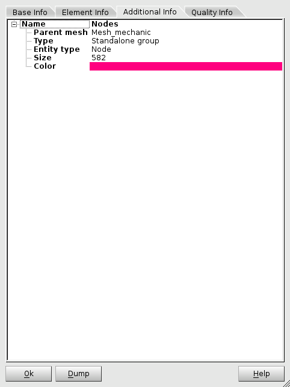
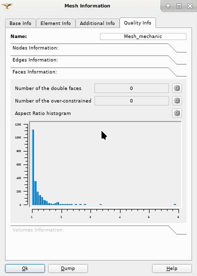

.. _mesh_infos_page:

****************
Mesh Information
****************

The user can obtain information about the selected mesh object (mesh, sub-mesh or group) using **Mesh Information** dialog box.

To view the **Mesh Information**, select your mesh, sub-mesh or group in the **Object Browser** and invoke **Mesh Information** item from the **Mesh** menu or from the context menu, or click *"Mesh Information"* button |img| in the toolbar.

The **Mesh Information** dialog box provides three tab pages:

* :ref:`Base Info <advanced_mesh_infos_anchor>` - to show base and quantitative information about the selected mesh object.
* :ref:`Element Info <mesh_element_info_anchor>` - to show detailed information about the selected mesh nodes or elements.
* :ref:`Additional Info <mesh_addition_info_anchor>` - to show additional information available for the selected mesh, sub-mesh or group object.
* :ref:`Quality Info <mesh_quality_info_anchor>` - to show overall quality information about the selected mesh, sub-mesh or group object.

.. _dump_mesh_infos:

Dump Mesh Infos
###############

The button **Dump** allows printing the information displayed in the dialog box to a .txt file. The dialog for choosing a file also allows to select which tab pages to dump via four check-boxes. The default state of the check-boxes can be changed via :ref:`Mesh information <mesh_information_pref>` preferences.

.. _advanced_mesh_infos_anchor:

Base Information
################

The **Base Info** tab page of the dialog box provides general information on the selected object - mesh, sub-mesh or mesh group: name, type, total number of nodes and elements separately for each type: 0D elements, edges, faces, volumes, balls.

.. centered::
	*"Base Info"* page

.. _mesh_element_info_anchor:

Mesh Element Information
########################

The **Element Info** tab page of the dialog box gives detailed information about the selected mesh node(s) or element(s), namely:

* For a node:
	* Node ID;
	* Coordinates (X, Y, Z);
	* Connectivity information (connected elements); double click in this line reveals information about these elements;
	* Position on a shape (for meshes built on a geometry);
	* Groups information (names of groups the node belongs to).

	.. image:: ../images/eleminfo1.png
		:align: center

	.. centered::
		*"Element Info"* page, node information

* For an element:
	* Element ID;
	* Type (triangle, quadrangle, etc.);
	* Gravity center (X, Y, Z coordinates);
	* Connectivity information (connected nodes); double click in a line of a node reveals the information about this node;
	* Quality controls (area, aspect ratio, volume, etc.);
	* Position on a shape (for meshes built on a geometry);
	* Groups information (names of groups the element belongs to).

	.. image:: ../images/eleminfo2.png
		:align: center

	.. centered::
		*"Element Info"* page, element information

The user can either input the ID of a node or element he wants to analyze directly in the dialog box or select the node(s) or element(s) in the 3D viewer.

If **Show IDs** is activated, IDs of selected nodes or elements are displayed in the 3D viewer.

.. note::
	The information about the groups, to which the node or element belongs, can be shown in a short or in a detailed form. By default, for performance reasons, this information is shown in a short form (group names only). The detailed information on groups can be switched on via :ref:`Show details on groups in element information tab <group_detail_info_pref>` option of :ref:`mesh_preferences_page`.

.. _mesh_addition_info_anchor:

Additional Information
######################

The **Additional Info** tab page of the dialog box provides an additional information on the selected object: mesh, sub-mesh or group.

For a mesh object, the following information is shown:

* Name
* Type: based on geometry, imported, standalone
* Shape (if mesh is based on geometry)
* File (if mesh is imported from the file)
* Groups
* Sub-meshes

.. centered::
	*"Additional Info"* page, mesh information

For a sub-mesh object, the following information is shown:

* Name
* Parent mesh
* Shape

.. centered::
	*"Additional Info"* page, sub-mesh information

.. _mesh_addition_info_group_anchor:

Additional info for Group
=========================

For a group object, the following information is shown:

* Name
* Parent mesh
* Type: standalone, group on geometry, group on filter
* Entity type: node, edge, face, volume
* Size
* Color
* Number of underlying nodes (for non-nodal groups)

.. centered::
	*"Additional Info"* page, group information

.. note::
	For the performance reasons, the number of underlying nodes is computed only by demand. For this, the user should press the "Compute" button (see picture). Also, the number of underlying nodes is automatically calculated if the size of the group does not exceed the :ref:`Automatic nodes compute limit <nb_nodes_limit_pref>` preference value (zero value means no limit).

.. _mesh_quality_info_anchor:

Quality Information
###################

The **Quality Info** tab provides overall information about mesh quality controls  on the selected object - mesh, sub-mesh or mesh group:

* Name;
* Nodes information:
	* Number of free nodes;
	* Maximal number of elements connected to a node;
	* Number of double nodes;
* Edges information:
	* Number of double edges;
* Faces information:
	* Number of double faces;
	* Number of over-constrained faces;
	* Aspect Ratio histogram;
* Volume information:
	* Number of double volumes;
	* Number of over-constrained volumes;
	* Aspect Ratio 3D histogram.

.. centered::
	*"Quality Info"* page

.. note::
	It is possible to change **Double nodes tolerance**, which will be used upon consequent pressing *Compute* button. The default value of the tolerance can be set via the :ref:`Quality controls <dbl_nodes_tol_pref>` preferences.

.. note::
	For performance reasons, all quality control values for big meshes are computed only by demand. For this, press the *Compute* button. Also, values are automatically computed if the number of nodes / elements does not exceed the :ref:`Automatic controls compute limit <auto_control_limit_pref>` set via the :ref:`Mesh information <mesh_information_pref>` preferences (zero value means that there is no limit).

.. note::
	The plot functionality is available only if the GUI module is built with Plot 2D Viewer (option SALOME_USE_PLOT2DVIEWER is ON when building GUI module).

See the :ref:`TUI Example <tui_viewing_mesh_infos>` for basic mesh information and :ref:`TUI Example <tui_node_element_mesh_infos>`.
