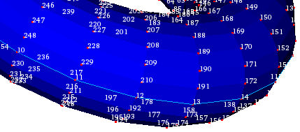
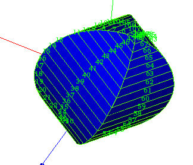

.. _numbering_page: 

*********
Numbering
*********

Displaying node numbers
#######################

In MESH you can display the ID numbers of all nodes of your mesh in the viewer.

*To display ID numbers of nodes:*

#. Display your mesh in the viewer
#. Right-click on the mesh in the 3D viewer and from the associated pop-up menu choose **Numbering > Display Nodes #**.

.. centered::
	Displayed node numbers

Displaying element numbers
##########################

In MESH you can display the ID numbers of all meshing elements composing your mesh in the viewer.

*To display ID numbers of elements:*

#. Display your mesh in the viewer
#. Right-click on the mesh in the 3D viewer and from the associated pop-up menu choose **Numbering > Display Elements #**.

.. centered::
	Displayed element numbers
