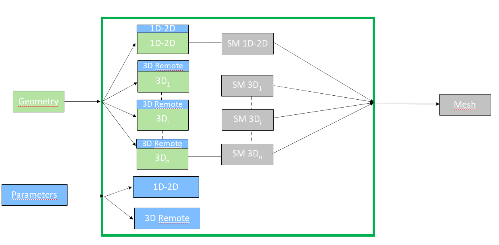

.. _parallel_compute_page:

******************
Parallel Computing
******************

.. warning::
  This functionality is a work in progress.

  It is only available for NETGEN.

  It is only available in TUI.

The goal here is to speed up computation by running sub-meshes in parallel
(multi-threading).

*******
Concept
*******

In order to parallelise the computation of the mesh we split the geometry into:

  * A 1D+2D compound
  * A list of 3D solids

Then create a sub-mesh for each of those geometry.
And associate Hypothesis to the mesh using a hypothesis on the whole geometry

We will first compute sequentially the 1D+2D compound with NETGEN_1D2D.

Then we will compute all the solids in parallel. Having done the 1D+2D first
ensure that all the solids can be computed without any concurrency.

******
How to
******

You follow the same principle as the creation of a sequential Mesh.

1. First you create the mesh:

	.. code-block:: python

		par_mesh = smesh.ParallelMesh(my_geom, name="par_mesh")

2. Define the Global Hypothesis that will be split into an hypothesis for the
   1D+2D compound and one for each of the 3D solids:

  .. code-block:: python

		NETGEN_3D_Parameters_1 = smesh.CreateHypothesisByAverageLength( 'NETGEN_Parameters',
                                                 'NETGENEngine', 34.641, 0 )
		par_mesh.AddGlobalHypothesis(NETGEN_3D_Parameters_1)

3. Set the method for the parallelisation:

  You have two methods for parallelisation:

  * Multihtreading: Will run the computation on your computer using the processors on your computer.

  .. code-block:: python

     par_mesh.SetParallelismMethod(smeshBuilder.MULTITHREAD)

  * MultiNodal: Will run the computation on a remote resource (cluster) that is defined in your salome catalog.

  .. code-block:: python

     par_mesh.SetParallelismMethod(smeshBuilder.MULTINODE)

4.  Set the parameters for the parallelism:

  *  Multithread:

	.. code-block:: python

		param = par_mesh.GetParallelismSettings()
		param.SetNbThreads(6)

  * Multinode:

  .. code-block:: python

     param = par_mesh.GetParallelismSettings()
     param.SetResource("cronos")
     param.SetNbProc(nbox**3)
     param.SetNbProcPerNode(2)
     param.SetNbNode(6)
     param.SetWcKey("P11N0:SALOME_COFEE")

5. Compute the mesh:
	.. code-block:: python

		is_done = par_mesh.Compute()
		if not is_done:
		    raise Exception("Error when computing Mesh")

**See Also** a sample script of :ref:`tui_create_parallel_mesh`.
