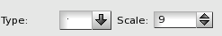
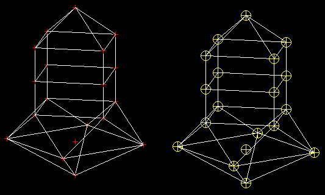
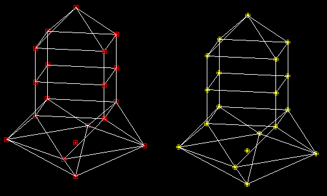

.. _point_marker_page:

************
Point Marker
************

You can change the representation of points in
the 3D viewer either by selecting one of the predefined
shapes or by loading a custom texture from an external file.

Standard point markers
----------------------

The Mesh module provides a set of predefined point marker shapes
which can be used to display points in the 3D viewer.
Each standard point marker has two attributes: type (defines shape
form) and scale factor (defines shape size).

.. centered::
	Mesh presentation with standard point markers

Custom point markers
--------------------

It is also possible to load a point marker shape from an external file.
This file should provide a description of the point texture as a set
of lines; each line is represented as a sequence of "0" and "1" symbols,
where "1" symbol means an opaque pixel and "0" symbol means a
transparent pixel. The width of the texture corresponds to the length
of the longest line in the file, expanded to the nearest byte-aligned
value. The height of the texture is equal to the number of non-empty
lines in the file. Note that missing symbols are replaced by "0".

Here is a texture file sample:
::

	11111111
	10000001
	10011001
	10111101
	10111101
	10011001
	10000001
	11111111

.. image:: ../images/point_marker_widget2.png
	:align: center

.. centered::
	Mesh presentation with custom point markers
