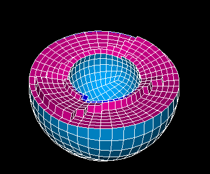
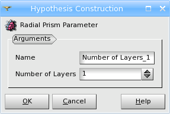
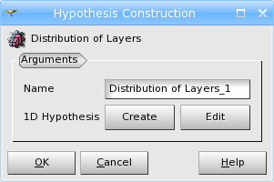

.. _radial_prism_algo_page:

************
Radial Prism
************

This algorithm applies to the meshing of a hollow 3D shape,
i.e. such shape should be composed of two meshed shells: an outer
shell and an internal shell without intersection with the outer
shell. One of the shells should be a :ref:`2D Projection <projection_2D>` of the other
shell. The meshes of the shells can consist both of triangles and
quadrangles.

The Radial Prism algorithm would fill the space between the two shells
with prisms.

.. centered::
	Cut-view of a hollow sphere meshed by Radial Prism algorithm

This algorithm also needs the information concerning the number and
distribution of mesh layers between the inner and the outer shapes.
This information can be defined using either of two hypotheses:

.. centered::
	*"Number of layers"* hypothesis

.. centered::
	*"Distribution of layers"* hypothesis

*Distribution of layers* hypothesis allows using most of 
:ref:`1D Hypotheses <a1d_meshing_hypo_page>` to define
the distribution of mesh layers.

**See also** a sample :ref:`TUI script <tui_radial_prism>`.
