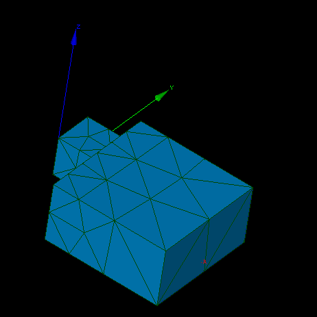
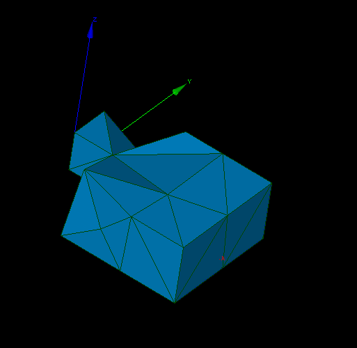
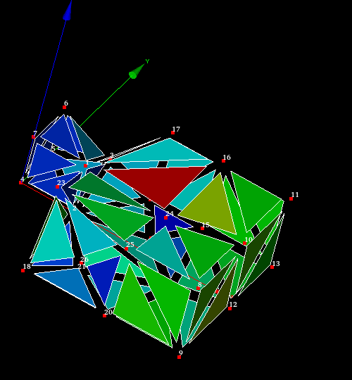
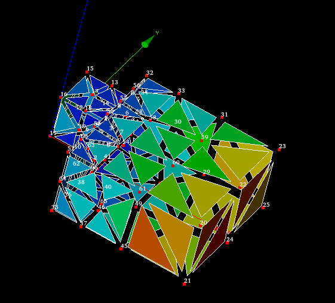

.. _reload_mesh_from_file_page:

*******************
Reload mesh from file
*******************

This operation allows reload original imported mesh, which was modified by different dedicated tools 

*Reload mesh from file:*

#. Select a mesh(es) (and display it in the 3D Viewer if you are going to pick elements by mouse).
#. From popup menu click on the *Reload from file* item

Each selected mesh will be updated to original state with saving display properties

.. centered::
	Original mesh

|

.. centered::
	Same mesh after apply "Merge Nodes"
	

.. centered::
	Set display properties

.. centered::
	Result after reload mesh
