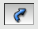

.. _revolution_page:

**********
Revolution
**********

Revolution is used to build mesh elements of plus one
dimension than the input ones.  Boundary elements around generated
mesh of plus one dimension are additionally created. All created
elements can be automatically grouped. Revolution can be used to create
a :ref:`structured mesh from scratch <extrusion_struct>`. 
See :ref:`extrusion_page` page for general information on Revolution,
which can be viewed as extrusion along a circular path.

*To apply revolution:*

#. From the **Modification** menu choose the **Revolution** item or click  **"Revolution"** button in the toolbar.

   The following dialog will appear:

	.. image:: ../images/revolution1.png
		:align: center
  

#. In this dialog:
    
	* Use *Selection* button |sel| to specify what you are going to select at a given moment, **Nodes**, **Edges** or **Faces**.

	* Specify **Nodes**, **Edges** and **Faces**, which will be revolved, by one of following means:
		* **Select the whole mesh, sub-mesh or group** activating this check-box.
		* Choose mesh elements with the mouse in the 3D Viewer. It is possible to select a whole area with a mouse frame.
		* Input the element IDs directly in **Node IDs**, **Edge IDs** and **Face IDs** fields. The selected elements will be highlighted in the viewer, if the mesh is shown there.
		* Apply Filters. **Set filter** button allows to apply a filter to the selection of elements. See more about filters in the :ref:`filtering_elements` page.
	* Specify the **Axis** of revolution:
		* Specify the coordinates of the start **Point** of the axis of revolution; either directly or by picking a node in the Viewer (selection of nodes is activated as you click the *Selection* button).
		* Specify the **Vector** of the axis in either of three ways:
			* directly adjust vector components;
			* click *Selection* button, choose **From Origin to selected Point** in the opened menu and pick a node in the Viewer; 
			* click *Selection* button, chose **Normal to selected Face** in the opened menu and pick a mesh face in the Viewer. 
	* Specify the **Angle** of revolution and the **Number of steps** of revolution,
		* **Angle by Step** - the elements are revolved by the specified angle at each step (i.e. for Angle=30 and Number of Steps=3, the elements will be extruded by 30 degrees twice for a total of 30*3=90)

		.. image:: ../images/revolutionsn2.png 
			:align: center

		.. centered::
			Example of Revolution with Angle by Step. Angle=30 and Number of Steps=3
        
		* **Total Angle** - the elements are revolved by the specified angle only once and the number of steps defines the number of iterations (i.e. for Angle=30 and Number of Steps=3, the elements will be revolved by 30/3=10 degrees twice for a total of 30).

		.. image:: ../images/revolutionsn1.png 
			:align: center

		.. centered::
			Example of Revolution with Total Angle. Angle=30 and Number of Steps=3
        
      
    
	* Specify the **Tolerance**, which is used to detect nodes lying on the axis of revolution.
	* Activate  **Preview** check-box to see the result mesh in the viewer.
	* If you activate **Generate Groups** check-box, the **result elements** created from **selected elements** contained in groups will be included into new groups named by pattern "<old group name>_rotated" and "<old group name>_top". For example if a selected quadrangle is included in *g_Faces* group (see figures below) then result hexahedra will be included in *g_Faces_rotated* group and a quadrangle created at the "top" of revolved mesh will be included in *g_Faces_top* group.  

	.. image:: ../images/extrusion_groups.png
		:align: center

	.. image:: ../images/extrusion_groups_res.png
		:align: center

	This check-box is active only if there are some groups in the mesh.

#. Click **Apply** or **Apply and Close** button to confirm the operation.

**See Also** a sample TUI Script of a :ref:`tui_revolution` operation.
