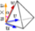

.. _scaled_jacobian_page:

***************
Scaled Jacobian
***************

The **Scaled Jacobian** mesh quality criteria, is a scalar measure of the deviation from the perfect element in the geometrical sense, this measure normalize the range of reported values
between [0,1] for a normal element, the value of 1 is considered a perfect element and 0 a element with a collapsed side. Negative values are also accepted for invalid elements.

The **Scaled Jacobian** is implemented for volumetric elements returning 0 for polyhedrons. For tetrahedron and hexahedron the close form 
is defined in `[1] <https://gitlab.kitware.com/third-party/verdict/-/blob/master/SAND2007-2853p.pdf>`_, for pyramids the minimum scaled jacobian of the four tetrahedrons formed
in the four vertices of the pyramid base is reported, for pentahedrons a decomposition into tetrahedron is also done and finally for hexahedron prisms the minimum scaled jacobian between two pentahedrons and one hexahedron is reported.

* Geometrically the Scaled Jacobian of a **tetrahedron** can be understood by the follow figure:

	.. image:: ../images/scaled_jacobian_tetra.png
		:align: center

	The reported Scaled Jacobian will be 1 if :math:`\alpha=45^{\circ}`

* For **hexadrons** this measure return 1 for the perfect non rotated elements:

	.. image:: ../images/scaled_jacobian_hexa.png
		:align: center

	The reported Scaled Jacobian will be 1 if :math:`\alpha=0^{\circ}` for all the vertices

*To visualize the Scaled Jacobian quality criterion in your mesh:*

#. Display your mesh in the viewer.
#. Choose **Controls > Volume Controls > Scaled Jacobian** or click *"Scaled Jacobian"* button |img| of the toolbar.
   
   Your mesh will be displayed in the viewer with its elements colored according to the applied mesh quality control criterion:

	.. image:: ../images/scaled_jacobian_mesh_tetra.png
		:align: center

**See Also** a sample TUI Script of a :ref:`tui_scaled_jacobian` filter.
