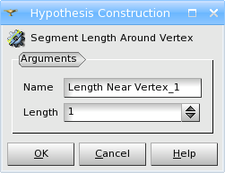

.. _segments_around_vertex_algo_page:

**********************
Segments around Vertex
**********************

**Segments around Vertex** algorithm is considered to be a 0D meshing
algorithm, but, of course, it doesn't mesh vertices. It allows to define
the local size of the segments in the neighborhood of a certain
vertex. If we assign this algorithm to a geometrical object of higher
dimension, it applies to all its vertices.

.. _note: To create 0D elements, use :ref:`adding_nodes_and_elements_page` operation.

Length of segments near vertex is defined by **Length Near Vertex** hypothesis.
This hypothesis is used by :ref:`Wire Discretization <a1d_algos_anchor>` or
:ref:`Composite Side Discretization <a1d_algos_anchor>` algorithms as
follows: a geometrical edge is discretized according to a 1D 
hypotheses and then nodes near vertices are modified to assure the 
segment length required by **Length Near Vertex** hypothesis.

**See also** a sample :ref:`TUI Script <tui_segments_around_vertex>`.
