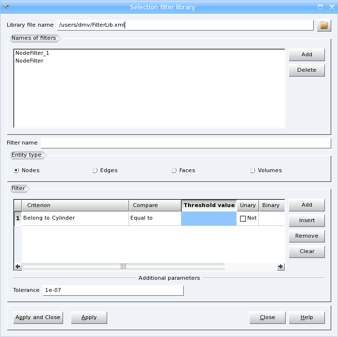
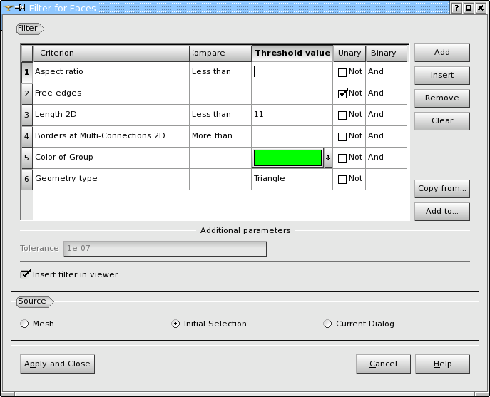

.. _selection_filter_library_page:

************************
Selection filter library
************************

Selection filter library allows creating and storing in files
the filters that can be later reused for operations on meshes. You can
access it via menu **Tools > Selection filter library**.
It is also possible to save/load a filter by invoking the filter library
from :ref:`filtering_elements` launched from any mesh operation.

**Library file name** shows the path and the file name where your
filters will be stored. By clicking the **Browse** button you can
load an existing filter library.

**Names of filters** lists the filters created or uploaded for
the current study. You can **Add** or **Delete** filters.

In **Filter name** box you can specify the name for your
filter. By default it is prefixed with the corresponding entity type.

.. _filtering_elements:

Filter Dialog
#############

When we use filters during group creation or another operation (by 
clicking **Set Filter** button in the corresponding dialog), the
dialog for setting filters looks as shown below.

The **Add** button creates a new criterion at the end of the list of
criteria. The **Insert** button creates a new criterion before the
selected criterion. The **Remove** button deletes the selected
criterion. The **Clear** button deletes all criteria.

If there is a choice of **Entity type** in the dialog, only
criteria of currently selected type are used to create or change a
filter, and criteria of hidden types (if were specified) are ignored.

Each **Entity type** has its specific list of criteria, however all
filters have common syntax. The **Threshold Value** should be specified 
for most criteria. For numerical criteria it is necessary to indicate if 
the found elements should be **More**, **Less** or **Equal** to this
**Value**. You can also reverse the sense of a criterion using **Unary**
operator *Not* and you should specify logical relations between
criteria using **Binary** operators *Or* and *And*.

Some criteria have the additional parameter of **Tolerance**. 

Switching on **Insert filter in viewer** check-box limits
selection of elements in the Viewer to the current filter.

In the **Source** field you choose if the filter will be applied to
the whole **Mesh**, the **Initial Selection** or the **Current Dialog**. 
If **Mesh** is chosen, the elements satisfying the filter
will be selected in the 3D Viewer. If **Initial Selection** is
chosen, the filter will be applied to the selected elements and the
elements rejected by the filter will be deselected. If **Current Dialog** 
is chosen, the filter will be applied to the list of
elements in the current dialog and the elements rejected
by the filter will be removed from the list.

**Copy from...** button gives you a possibility to load an
existing filter from **Selection filter library** and **Add to...** 
button gives you a possibility to save your current filter in the Library.

.. note::
	If the button **Apply and Close** is disabled, there is no selected mesh in the Object Browser and the filter can not be created. You have to select the mesh and the button will be enabled.

Some criteria are applicable to all **Entity types**:

* **Belong to Geom** selects entities whose all nodes lie on the shape defined by **Threshold Value**. If the threshold shape is a sub-shape of the main shape of the mesh, the filtering algorithm works faster because node-to-shape association is used instead of measuring distance between nodes and the shape, and **Tolerance** is not used. If the threshold shape is any other shape, the algorithm works slower because distance between nodes and the shape is measured and is compared with **Tolerance**. The latter approach (distance measurement) is also used if an element is not associated to any shape.
* **Lying on Geom** selects entities whose at least one node lies on the shape defined by the **Threshold Value**. If the threshold shape is a sub-shape of the main shape of the mesh, the filtering algorithm works faster because node-to-shape association is used instead of measuring distance between nodes and the shape, and **Tolerance** is not used. If the threshold shape is any other shape, the algorithm works slower because distance between nodes and the shape is measured and is compared with **Tolerance**. The latter approach (distance measurement) is also used if an element is not associated to any shape.
* **Belong to Mesh Group** selects entities included into the mesh group defined by the **Threshold Value**.
* **Range of IDs** allows selection of entities with the specified IDs. **Threshold Value** can be, for example: "1,2,3,50-60,63,67,70-78"
* **Color of Group** allows selection of entities belonging to the Group with the color defined by the **Threshold Value**.
* **Elements of a domain** allows selection of entities belonging to one domain of a mesh. The domain is mesh part not connected to other parts. **Threshold Value** locating any element of the domain can be either
	* node ID (that you can pick in the Viewer) or
	* geometrical vertex (that you can pick either in the Viewer or in the Object Browser) or
	* 3 coordinates of a point (that you can enter in TUI mode only).

Some criteria are applicable to entities of dimension more than zero, i.e. to **Edges**, **Faces** and **Volumes**:

* **Linear** allows selection of Linear or Quadratic elements (if Unary is set to "Not")
* **Geometry type** allows selection of elements by their geometric type defined by the **Threshold Value**. The list of available geometric types depends on the current entity type.
* **Entity type** allows selection of elements by their type defined as a combination of geometry type and the number of nodes.

The following criteria are applicable to Entities of **all** types except for *Volumes*:

* **Belong to Plane** selects entities whose all nodes belong to a specified plane within a given **Tolerance**.
* **Belong to Cylinder** selects entities whose all nodes belong to a specified cylinder within a given **Tolerance**.
* **Belong to Surface** selects entities whose all nodes belong to a specified arbitrary surface within a given **Tolerance**.

The following criteria allow selecting mesh **Nodes**:

* **Free nodes** selects nodes not belonging to any mesh element.
* **Double nodes** selects a node coincident with other nodes (within a given **Tolerance**). See also :ref:`Double Nodes quality control <tui_double_nodes_control>`.
* **Connectivity number** selects nodes with a number of connected elements, which is more, less or equal to **Threshold Value**. Elements of the highest dimension are countered only.

The following criteria allow selecting mesh **Edges**:

* **Free Borders** selects free 1D mesh elements, i.e. edges belonging to one element (face or volume) only. See also a :ref:`Free Borders quality control <free_borders_page>`.
* **Double edges** selects 1D mesh elements basing on the same set of nodes. See also :ref:`filter_double_elements` quality control.
* **Borders at Multi-Connections** selects edges belonging to several faces. The number of faces should be more, less or equal (within a given **Tolerance**) to **Threshold Value**. See also a :ref:`borders_at_multi_connection_page` quality control.
* **Length** selects edges with a value of length, which is more, less or equal (within a given **Tolerance**) to **Threshold Value**. See also a :ref:`length_page`  quality control.

The following criteria allow selecting mesh **Faces**:

* **Aspect ratio** selects 2D mesh elements with an aspect ratio (see also an :ref:`aspect_ratio_page` quality control), which is more, less or equal (within a given **Tolerance**) to **Threshold Value**.
* **Warping** selects quadrangles with warping angle (see also a :ref:`warping_page` quality control), which is more, less or equal (within a given **Tolerance**) to **Threshold Value**.
* **Minimum angle** selects triangles and quadrangles with minimum angle (see also a :ref:`minimum_angle_page` quality control), which is more, less or equal (within a given **Tolerance**) to **Threshold Value**.
* **Taper** selects quadrangles cells with taper value (see also a :ref:`taper_page` quality control), which is more, less or equal (within a given **Tolerance**) to **Threshold Value**.
* **Skew** selects triangles and quadrangles with skew value (see also a :ref:`skew_page` quality control), which is more, less or equal (within a given **Tolerance**) to **Threshold Value**.
* **Area** selects triangles and quadrangles with a value of area (see also an :ref:`area_page` quality control), which is more, less or equal (within a given **Tolerance**) to **Threshold Value**.
* **Free edges** selects 2D mesh elements having at least one edge, which is not shared with other faces. See also a :ref:`free_edges_page` quality control.
* **Free faces** selects 2D mesh elements, which belong to less than two volumes.
* **Double faces** selects 2D mesh elements basing on the same set of nodes. See also :ref:`filter_double_elements` quality control.
* **Faces with bare border** selects 2D mesh elements having a free border without an edge on it. See also :ref:`bare_border_faces_page` quality control.
* **Over-constrained faces** selects 2D mesh elements having only one border shared with other 2D elements. See also :ref:`over_constrained_faces_page` quality control.
* **Borders at Multi-Connections 2D** selects cells consisting of edges belonging to several elements of mesh. The number of mesh elements should be more, less or equal (within a given **Tolerance**) to **Threshold Value**. See also a :ref:`borders_at_multi_connection_2d_page` quality control.
* **Length 2D** selects triangles and quadrangles combining of the edges with a value of length, which is more, less or equal (within a given **Tolerance**) to **Threshold Value**. See also a :ref:`length_2d_page` quality control.
* **Coplanar faces** selects mesh faces neighboring the one selected by ID in **Threshold Value** field, if the angle between the normal to the neighboring face and the normal to the selected face is less then the angular tolerance (defined in degrees). Selection continues among all neighbor faces of already selected ones.
* **Element Diameter 2D** selects triangles and quadrangles composed of the edges and diagonals with a value of length, which is more, less or equal (within a given **Tolerance**) to **Threshold Value**. See also a :ref:`max_element_length_2d_page` quality control.

The following criteria allow selecting mesh **Volumes**:

* **Aspect ratio 3D** selects 3D mesh elements with an aspect ratio (see also an :ref:`aspect_ratio_3d_page` quality control), which is more, less or equal (within a given **Tolerance**) to **Threshold Value**.
* **Volume** selects 3D mesh elements with a value of volume (see also a :ref:`volume_page` quality control), which is more, less or equal (within a given **Tolerance**) to **Threshold Value**.
* **Element Diameter 3D** selects 3D mesh elements composed of the edges and diagonals with a value of length, which is more, less or equal (within a given **Tolerance**) to **Threshold Value**. See also a :ref:`max_element_length_3d_page` quality control.
* **Double volumes** selects 3D mesh elements basing on the same set of nodes. See also :ref:`filter_double_elements` quality control.
* **Bad oriented volume** selects mesh volumes, which are incorrectly oriented from the point of view of MED convention.
* **Over-constrained volumes** selects mesh volumes having only one facet shared with other volumes. See also :ref:`over_constrained_volumes_page` quality control.
* **Volumes with bare border** selects 3D mesh elements having a free border without a face on it. See also :ref:`bare_border_volumes_page` quality control.

**See also** sample scripts of :ref:`tui_filters_page`.

