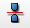

.. _symmetry_page: 

********
Symmetry
********

This geometrical operation allows to perform a symmetrical copy of your mesh or some of its elements.

*To create a symmetrical copy:*

#. From the **Modification** menu choose **Transformation** -> **Symmetry** item  or click *"Symmetry"* button |img| in the toolbar.

   The following dialogs will appear, where you can choose a way to mirror:

	* through a point:

	.. image:: ../images/symmetry1.png 
		:align: center

	* through an axis:

	.. image:: ../images/symmetry2.png 
		:align: center

	* through a plane (defined by a point and a normal to the plane):

	.. image:: ../images/symmetry3.png
 		:align: center

#. In the dialog:

	* specify the elements for the symmetry operation:

		* **Select the whole mesh, submesh or group** activating this checkbox; or
		* choose mesh elements with the mouse in the 3D Viewer. It is possible to select a whole area with a mouse frame; or 
		* input the element IDs directly in **ID Elements** field. The selected elements will be highlighted in the viewer; or
		* apply Filters. **Set Filter** button allows to apply a :ref:`filtering_elements` to the selection of elements. 

	* depending on the nature of the mirror object: 

		* if the mesh is mirrored through a point, specify the coordinates of the point, either directly or by picking a mesh node;
		* if the mesh is mirrored through an axis: 

		  * specify the coordinates of the start **Point** of the axis, either directly or by picking a mesh node;
		  * specify the components of axis **Vector**, either directly or by picking a mesh node, in which case **Vector** is defined as a shift between the **Point** and the node;

		* if the mesh is mirrored through a plane:

		  * specify the coordinates of the **Point** lying on the plane, either directly or by picking a mesh node;
		  * specify the components of plane **Normal**, either directly or by picking a mesh node, in which case **Normal** is defined as a shift between the **Point** and the node.

		* specify the conditions of symmetry operation:

                  * activate **Move elements** radio button to change the location of the selected elements within the current mesh;
                  * activate **Copy elements** radio button to duplicate the selected elements at the new location within the current mesh;
                  * activate **Create as new mesh** radio button to create a new element in a new mesh; the new mesh appears in the Object Browser with the default name *MeshName_mirrored* (it is possible to change this name in the adjacent box);
                  * activate **Copy groups** check-box to put new mesh entities into new groups if source entities belong to some groups. New groups are named by pattern "<old group name>_mirrored".

	* activate **Preview** check-box to show the result of transformation in the viewer;
	* click **Apply** or **Apply and Close** button to confirm the operation.

**See Also** a sample TUI Script of a 
:ref:`tui_symmetry` operation.  

