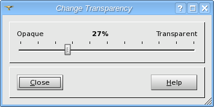

.. _transparency_page:

************
Transparency
************

Using this slider you can set the transparency of shading. Absolutely
transparent shading will be invisible. By default it is absolutely
opaque.

