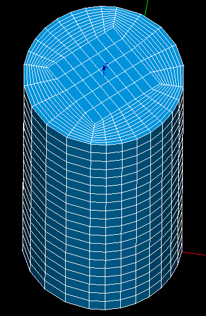

.. _tui_creating_meshes_page:

***************
Creating Meshes
***************

.. contents:: `Table of contents`

First of all see :ref:`example_3d_mesh` which is an example of good python script style for Mesh module.

.. _construction_of_a_mesh:

Construction of a mesh
======================

.. literalinclude:: ../../examples/creating_meshes_ex01.py
    :language: python

:download:`Download this script <../../examples/creating_meshes_ex01.py>`

.. _tui_construction_submesh:

Construction of a sub-mesh
==========================

.. literalinclude:: ../../examples/creating_meshes_ex02.py
    :language: python

:download:`Download this script <../../examples/creating_meshes_ex02.py>`

.. _change_priority_of_submeshes_in_mesh:

Change priority of sub-meshes in mesh
=====================================

.. literalinclude:: ../../examples/creating_meshes_ex03.py
    :language: python

:download:`Download this script <../../examples/creating_meshes_ex03.py>`

.. _tui_editing_while_meshing:

Intermediate edition while meshing
==================================

.. literalinclude:: ../../examples/a3DmeshOnModified2Dmesh.py
    :language: python

:download:`Download this script <../../examples/a3DmeshOnModified2Dmesh.py>`

.. _tui_editing_mesh:

Editing a mesh (i.e. changing hypotheses)
=========================================

.. literalinclude:: ../../examples/creating_meshes_ex04.py
    :language: python

:download:`Download this script <../../examples/creating_meshes_ex04.py>`

.. _tui_export_mesh:

Export of a Mesh
================

.. literalinclude:: ../../examples/creating_meshes_ex05.py
    :language: python

:download:`Download this script <../../examples/creating_meshes_ex05.py>`

.. _how_to_mesh_a_cylinder_with_hexahedrons: 

How to mesh a cylinder with hexahedrons?
========================================

The next script creates a hexahedral mesh on a cylinder. A picture below the script
demonstrates the resulting mesh.

.. literalinclude:: ../../examples/creating_meshes_ex06.py
    :language: python

:download:`Download this script <../../examples/creating_meshes_ex06.py>`

.. _tui_building_compound: 

Building a compound of meshes
=============================

.. literalinclude:: ../../examples/creating_meshes_ex07.py
    :language: python

:download:`Download this script <../../examples/creating_meshes_ex07.py>`

.. _tui_copy_mesh:

Mesh Copying
============

.. literalinclude:: ../../examples/creating_meshes_ex08.py
    :language: python

:download:`Download this script <../../examples/creating_meshes_ex08.py>`

