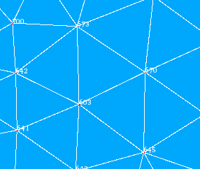
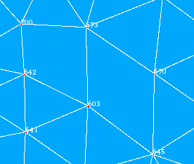

.. _uniting_set_of_triangles_page: 

**************************
Uniting a set of triangles
**************************

It is possible to unite many neighboring triangles into
quadrangles by deletion of the common edge.

*To union several triangles:*

#. Select a mesh (and display it in the 3D Viewer if you are going to pick elements by mouse).
#. In the **Modification** menu select the **Union of triangles** item or click *"Union of triangles"* button |img| in the tool-bar.

   The following dialog box will appear:

	.. image:: ../images/a-unionoftriangles.png
		:align: center

	* **The main list** shall contain the triangles which will be united. You can click on a triangle in the 3D viewer and it will be highlighted. After that click the **Add** button and the ID of this triangle will be added to the list. To remove a selected element or elements from the list click the **Remove** button. The **Sort** button allows to sort the list of IDs. The **Filter** button allows to apply a definite :ref:`filter <filtering_elements>` to selection of triangles.
	* **Apply to all** radio button allows to apply the operation to all triangles of the selected mesh.
	* **Preview** provides a preview in the viewer.
	* **Criterion** menu allows to choose a quality criterion, which will be optimized to select triangles to unite.
	* **Select from** set of fields allows to choose a sub-mesh or an existing group whose triangle elements then can be added to the list.

#. Click the **Apply** or **Apply and Close** button to confirm the operation.

If some selected triangle elements have no adjacent edges with one of
the others, the operation on these elements shall take no effect.

.. centered::
	The chosen triangles

.. centered::
	The union of several triangles - several quadrangular cells are created

**See Also** a sample TUI Script of a 
:ref:`tui_uniting_set_of_triangles` operation.  

