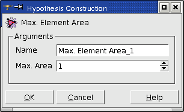
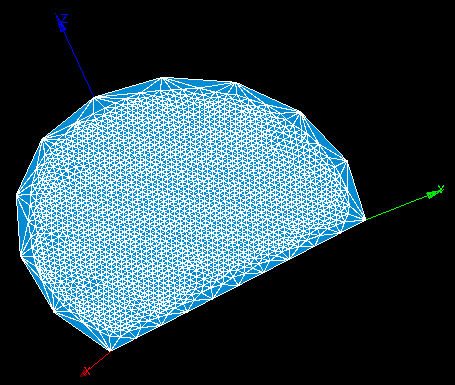

.. _a2d_meshing_hypo_page:

*********************
2D Meshing Hypotheses
*********************

- :ref:`max_element_area_anchor`
- :ref:`length_from_edges_anchor`
- :ref:`hypo_quad_params_anchor`

.. _max_element_area_anchor:

Max Element Area
################

**Max Element Area** hypothesis is applied for meshing of faces composing your geometrical object. Definition of this hypothesis consists of setting the **maximum area** of mesh faces, which will compose the mesh of these faces.

|    

.. centered::
	"In this example, Max. element area is very small compared to the 1D hypothesis"

**See Also** a sample TUI Script of a :ref:`tui_max_element_area` hypothesis operation. 

.. _length_from_edges_anchor:

Length from Edges
#################

**Length from edges** hypothesis defines the maximum linear size of mesh faces as an average length of mesh edges approximating the meshed face boundary.

**See Also** a sample TUI Script of a :ref:`tui_length_from_edges` hypothesis operation.

.. _hypo_quad_params_anchor:

Quadrangle parameters
#####################

.. image:: ../images/ hypo_quad_params_dialog.png 
	:align: center

.. centered::
	"Quadrangle parameters: Transition"

**Quadrangle parameters** is a hypothesis for :ref:`quad_ijk_algo_page`.

**Transition** tab is used to define the algorithm of transition between opposite sides of the face with a different number of segments on them. The following types of transition algorithms are available:

* **Standard** is the default case, when both triangles and quadrangles are possible in the transition area along the finer meshed sides.
* **Triangle preference** forces building only triangles in the transition area along the finer meshed sides.

	.. note::
		This type corresponds to **Triangle Preference** additional hypothesis, which is obsolete now.

* **Quadrangle preference** forces building only quadrangles in the transition area along the finer meshed sides. This hypothesis has a restriction: the total quantity of segments on all four face sides must be even (divisible by 2).

	.. note::
		This type corresponds to **Quadrangle Preference** additional hypothesis, which is obsolete now.

* **Quadrangle preference (reversed)** works in the same way and with the same restriction as **Quadrangle preference**, but the transition area is located along the coarser meshed sides.
* **Reduced** type forces building only quadrangles and the transition between the sides is made gradually, layer by layer. This type has a limitation on the number of segments: one pair of opposite sides must have the same number of segments, the other pair must have an even total number of segments. In addition, the number of rows between sides with different discretization should be enough for the transition. Following the fastest transition pattern, three segments become one (see the image below), hence the least number of face rows needed to reduce from Nmax segments to Nmin segments is log3( Nmax / Nmin ). The number of face rows is equal to the number of segments on each of equally discretized sides.

.. image:: ../images/ reduce_three_to_one.png 
	:align: center

.. centered::
	"The fastest transition pattern: 3 to 1"

**Base vertex** tab allows using Quadrangle: Mapping algorithm for meshing of trilateral faces. In this case it is necessary to select the vertex, which will be used as the forth degenerated side of quadrangle.

.. image:: ../images/ hypo_quad_params_dialog_vert.png 
	:align: center

.. centered::
	"Quadrangle parameters: Base Vertex"

.. image:: ../images/ hypo_quad_params_1.png 
	:align: center

.. centered::
	"A face built from 3 edges"

.. image:: ../images/ hypo_quad_params_res.png 
	:align: center

.. centered::
	"The resulting mesh"

This parameter can be also used to mesh a segment of a circular face. Please, consider that there is a limitation on the selection of the vertex for the faces built with the angle > 180 degrees (see the picture).

.. image:: ../images/ hypo_quad_params_2.png 
	:align: center

.. centered:: 
	"3/4 of a circular face"

In this case, selection of a wrong vertex for the **Base vertex** parameter will generate a wrong mesh. The picture below shows the good (left) and the bad (right) results of meshing.

.. image:: ../images/ hypo_quad_params_res_2.png 
	:align: center

.. centered::
	"The resulting meshes"

.. image:: ../images/ hypo_quad_params_dialog_enf.png 
	:align: center

.. centered::
	"Quadrangle parameters: Enforced nodes"

**Enforced nodes** tab allows defining points, where the algorithm should create nodes. There are two ways to define positions of the enforced nodes.

	* **Vertices** group allows to set up shapes whose vertices will  define positions of the enforced nodes. Only vertices successfully projected to the meshed face and located close enough to the meshed face will be used to create the enforced nodes.
	* **Points** group allows to explicitly define coordinates of points used to create the enforced nodes. Only points successfully projected to the meshed face and located close enough to the meshed face will be used to create the enforced nodes.

..  note::
	**Enforced nodes** cannot be created at **Reduced** transition type.

Let us see how the algorithm works:
	* Initially positions of nodes are computed without taking into account the enforced vertex (yellow point). 

.. image:: ../images/ hypo_quad_params_enfnodes_algo1.png
	:align: center

.. centered::
	"Initial mesh"

* Then the node closest to the enforced vertex is detected. Extreme nodes of the row and column of the detected node are used to create virtual edges (yellow lines) ending at the enforced vertex. 

	.. image:: ../images/ hypo_quad_params_enfnodes_algo2.png
		:align: center
	.. centered::
		 "Creation of virtual edges"
	
* Consequently, the meshed face is divided by the virtual edges into four quadrilateral sub-domains each of which is meshed as usually: the nodes of the row and column of the detected node are moved to the virtual edges and the quadrilateral elements are constructed. 
	
	.. image:: ../images/ hypo_quad_params_enfnodes_algo3.png 
		:align: center
	
	.. centered::
		"Final mesh"	

If there are several enforced vertices, the algorithm is applied recursively to the formed sub-domains.

**See Also** a sample TUI Script of a :ref:`tui_quadrangle_parameters` hypothesis.

