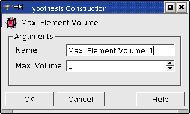

.. _a3d_meshing_hypo_page:

*********************
3D Meshing Hypotheses
*********************

.. _max_element_volume_hypo:

Max Element Volume hypothesis
#############################

**Max Element Volume** hypothesis is applied for meshing of 3D objects composing your geometrical object. Definition of this hypothesis consists of setting the **maximum volume** of 3D meshing elements (depending on the chosen meshing algorithm it can be **hexahedrons** or **tetrahedrons**), which will compose the mesh of these 3D objects.

**See Also** a sample TUI Script of a :ref:`tui_max_element_volume` operation.  

.. _block_renumber_hypo:

Renumber hypothesis
###################

**Renumber** hypothesis is applied for meshing of 3D objects along with **Hexahedron (i,j,k)** algorithm.

Order and hence numbering of hexahedral elements in the structured mesh generated by **Hexahedron (ijk)** algorithm depends on the order of faces in a block geometry. Nodes are not in a structured order, since geometrical edges and faces are discretized before construction of hexahedra. **Renumber** hypothesis allows for getting hexahedra and nodes ordered like in a structured grid.

.. image:: ../images/block_renumber_hyp.png
	:align: center

**Renumber** hypothesis allows to define direction of **i, j** and **k** axes of a block. For that you specify two vertices of the block

* **Vertex (0,0,0)** located at the origin of the block local coordinate system.
* **Vertex (0,0,1)** located at the end of **k** axis of the block.

Axes **i** and **j** are found automatically using the right-hand rule.

For blocks with edges parallel to the axes of global coordinate system, their local coordinate system by default is defined as having axes parallel to the global ones. So, for such blocks specification of vertices is optional, it is enough just to assign **Renumber** hypothesis.

**See Also** a sample TUI Script of a :ref:`tui_block_renumber` operation.  

