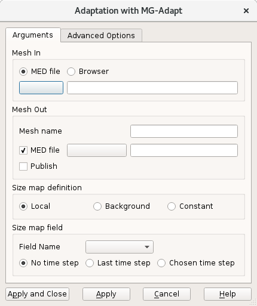
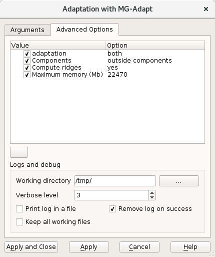

.. _adaptation_page:

**********
Adaptation
**********

Mesh module provides the possibility to perform different adaptations of a mesh.

.. note::
  A mesh adaptation based on splitting is available by the HOMARD module.

.. _mg_adapt_anchor:

MG_Adapt
########

For meshes made of triangles and/or tetrahedra, remeshing operations are available with the MG-Adapt plugin. The remeshing is based on wanted mesh sizes defined over the mesh or as a constant. The boundaries are dedeuced from the initial mesh.

To start **Remeshing** operation, select **MG Adapt** tab in **Adaptation** dialog.

* **Mesh In** is the initial mesh to remesh.
* **Mesh Out** is the resulting mesh after remeshing. By default, the name of the initial mesh is kept and the file name is based on the name of the initial mesh.
* **Size map definition** is a choice between **Local**, **Background** and **Constant**.

- If the choice is **Background**, the name of the MED file must be given.
- If the choice is **Local** or **Background**, the name of the field must be selected from the list, together with time step.

.. note::
  The exhaustive description of MG-Adapt can be read into its documentation. It can be reached by the general help button.

**See Also** a sample TUI Script of :ref:`tui_adaptation_page`.
