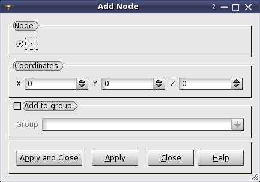
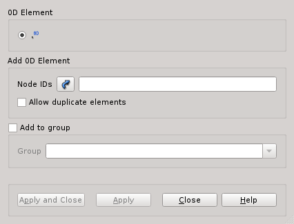
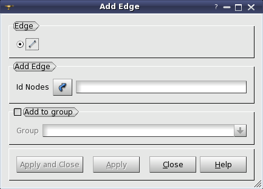
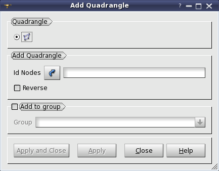
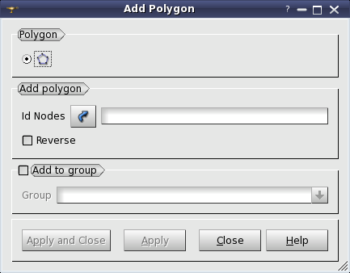
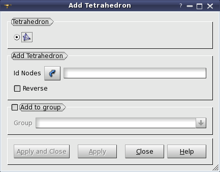
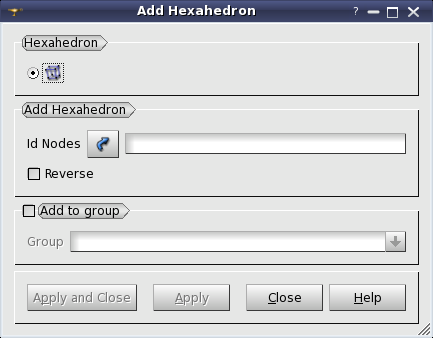
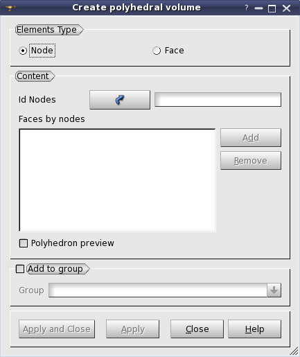

.. _adding_nodes_and_elements_page: 

*************************
Adding nodes and elements
*************************

In MESH you can add to your mesh different elements such as:

* :ref:`adding_nodes_anchor`
* :ref:`adding_0delems_anchor`
* :ref:`adding_0delems_on_all_nodes_anchor`
* :ref:`adding_balls_anchor`
* :ref:`adding_edges_anchor`
* :ref:`adding_triangles_anchor`
* :ref:`adding_quadrangles_anchor`
* :ref:`adding_polygons_anchor`
* :ref:`adding_tetrahedrons_anchor`
* :ref:`adding_hexahedrons_anchor`
* :ref:`adding_octahedrons_anchor`
* :ref:`adding_polyhedrons_anchor`

The convention of nodal connectivity of elements used in SALOME is the MED library convention. You can consult the description of nodal connectivity of elements in the documentation on MED library or :ref:`connectivity_page`.

**To add a node or an element to your mesh:**

#. Select your mesh in the Object Browser or in the 3D viewer.
#. From the **Modification** menu choose the **Add** item, the following associated sub-menu will appear:

	.. image:: ../images/image152.png
		:align: center

	From this sub-menu select the type of element which you would like to add to your mesh.

	.. note::
		All dialogs for new node or element adding to the mesh provide the possibility to automatically add a node or element to the specified group or to create it anew using **Add to group** box, that allows choosing an existing group for the created node or element or giving the name to a new group. By default, the **Add to group** check box is switched off. If the user switches this check box on, the combo box listing all currently existing groups of the corresponding type becomes available. By default, no group is selected. In this case, when the user presses **Apply** or **Apply & Close** button, the warning message box informs the user about the necessity to input new group name. The combo box lists groups of all the 
		:ref:`grouping_elements_page`: both 
		:ref:`standalone_group`,
		:ref:`group_on_filter`, and 
		:ref:`group_on_geom`. If the user chooses a group on geometry or on filter, he is warned and proposed to convert this group to standalone.

	If the user rejects conversion operation, it is cancelled and a new node/element is not created!

**See Also** sample TUI Scripts of :ref:`tui_adding_nodes_and_elements` operations.  

.. _adding_nodes_anchor:

Adding nodes
############

In this dialog box set coordinates for your node in the **Coordinates** set of fields and click the **Apply** or **Apply and Close** button. Your node will be created:

.. _adding_0delems_anchor:

Adding 0D elements
##################

In this dialog box specify nodes which will form your 0D elements by selecting them in the 3D viewer. Activate **Allow duplicate elements** 
to get several 0D elements on a node. Click the **Apply** or **Apply and Close** button. Your 0D elements will be created:

.. _adding_0delems_on_all_nodes_anchor:

Making 0D elements on Element Nodes
###################################

There is another way to create 0D elements. It is possible to create 0D elements on all nodes of the selected mesh, sub-mesh, or a group of elements or nodes.

.. image:: ../images/dlg_0D_on_all_nodes.png
	:align: center

In this dialog

*  The radio-buttons allow choosing the type of object to create 0D elements on.
    
	* **Mesh, sub-mesh, group** - this button allows selecting a mesh, a sub-mesh or a group to create 0D elements on the nodes of its elements. The name of the selected object is shown in the dialog. 
	* **Elements** - this button allows selecting elements in the VTK viewer or typing their IDs in the dialog.
	* **Nodes** - this button allows selecting nodes to create 0D elements on in the VTK viewer or typing their IDs in the dialog.
  
* **Set Filter** button allows selecting elements or nodes by filtering mesh elements or nodes with different criteria (see :ref:`filtering_elements`).
* Activate **Allow duplicate elements** to get several 0D elements on a node. 
* Switching on **Add to group** check-box allows specifying the name of the group to which all created or found (existing) 0D elements will be added. You can either select an existing group from a drop-down list, or enter the name of the group to be created. If a selected existing :ref:`grouping_elements_page` is not Standalone (Group On Geometry or Group On Filter) it will be converted to Standalone.

.. warning:: If **Add to group** is activated it has to be filled in.

.. _adding_balls_anchor:

Adding ball elements
####################

In this dialog box specify the nodes, which will form your ball elements, either by selecting them in the 3D viewer or by manually entering their IDs, specify the ball diameter and click the **Apply** or **Apply and Close** button.

.. _adding_edges_anchor:

Adding edges
############

In this dialog box specify the nodes which will form your edge by selecting them in the 3D viewer with pressed Shift button and click the **Apply** or **Apply and Close** button. Your edge will be created:

.. _adding_triangles_anchor:

Adding triangles
################

In this dialog box specify the nodes which will form your triangle by selecting them in the 3D viewer with pressed Shift button and click the **Apply** or **Apply and Close** button. Your triangle will be created:

.. _adding_quadrangles_anchor:

Adding quadrangles
##################

In this dialog box specify the nodes which will form your quadrangle by selecting them in the 3D viewer with pressed Shift button and click the **Apply** or **Apply and Close** button. Your quadrangle will be created:

.. _adding_polygons_anchor:

Adding polygons
###############

In this dialog box specify the nodes which will form your polygon by selecting them in the 3D viewer with pressed Shift button and click the **Apply** or **Apply and Close** button.

.. _adding_tetrahedrons_anchor:

Adding tetrahedrons
###################

In this dialog box specify the nodes which will form your tetrahedron by selecting them in the 3D viewer with pressed Shift button and click the **Apply** or **Apply and Close** button. Your tetrahedron will be created:

.. image:: ../images/image70.jpg
	:align: center

.. _adding_hexahedrons_anchor:

Adding hexahedrons
##################

In this dialog box specify the nodes which will form your hexahedron by selecting them in the 3D viewer with pressed Shift button and click
the **Apply** or **Apply and Close** button. Your hexahedron will be created:

.. _adding_octahedrons_anchor:

Adding hexagonal prism
######################

In the Add Hexagonal Prism dialog box specify the nodes which will form your hexagonal prism by selecting them in the 3D viewer with pressed Shift button and click the **Apply** or **Apply and Close** button. Your hexagonal prism will be created:

.. _adding_polyhedrons_anchor:

Adding polyhedrons
##################

There are two different ways to add polyhedral volumes. 

If you select **Node** as **Elements Type** you will specify the nodes which will form the faces of your polyhedron by selecting the nodes in the 3D viewer with pressed Shift button and clicking the  **Add** button to add the face in the list of Faces by Nodes, which will form your polyhedron. Note, that it could be very useful to toggle Polyhedron Preview checkbox to see the results of your selection.
The second way is somewhat simpler, however, there are cases when it does not provide you with the necessary level of precision. If you select **Face** as **Elements Type**, you will be able to select the faces which will form your polyhedron in the 3D viewer with pressed Shift button. If you've managed to obtain the necessary result, click the **Apply** or **Apply and Close** button. Your polyhedron will be created:

