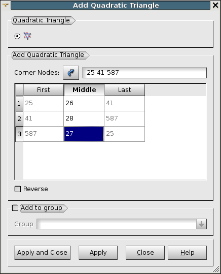

                                    
.. _adding_quadratic_elements_page: 

*************************
Adding Quadratic Elements
*************************  

MESH module allows you to work with **Quadratic Elements**.

Quadratic elements are defined by the same corner nodes as the corresponding linear ones, but in addition they have *midside* nodes located between the corner nodes on element sides.

If a quadratic 2D element has an additional node at the element center, it is a bi-quadratic element (both TRIA7 and QUAD9 elements are supported). If a quadratic hexahedral element has 7 additional nodes: at the element center and at the center of each side, it is a tri-quadratic element (or HEXA27).

The convention of nodal connectivity of elements used in SALOME is the MED library convention. You can consult the description of nodal connectivity of elements in the documentation on MED library or :ref:`here <connectivity_page>`.

There are several ways to create quadratic elements in your mesh:

* manually (this way is described below);
* use :ref:`quadratic_mesh_anchor` hypothesis to generate a quadratic mesh on your geometry;
* convert an existing linear mesh to a quadratic one (see :ref:`convert_to_from_quadratic_mesh_page`).

**To add a quadratic element to your mesh:**

#. Select your mesh in the Object Browser or in the 3D viewer.

#. From the **Modification** menu choose the **Add** item and select one of the following:

	.. image:: ../images/image152.png
		:align: center

.. note::
	All dialogs for adding quadratic element to the mesh provide the possibility to automatically add an element to the specified group or to create the group anew using **Add to group** box, that allows choosing an existing group for the created node or element or giving the name to a new group. By default, the **Add to group** check box is switched off. If the user switches this check box on, the combo box listing all currently existing groups of the corresponding type becomes available. By default, no group is selected. In this case, when the user presses **Apply** or **Apply & Close** button, the warning message box informs the user about the necessity to input a new group name. The combo box lists groups of all the :ref:`three types <grouping_elements_page>`: both :ref:`standalone groups <standalone_group>`, :ref:`groups on filter <group_on_filter>`, and :ref:`groups on geometry <group_on_geom>`. If the user chooses a group on geometry or on filter, he is warned and proposed to convert this group to standalone. If the user rejects conversion operation, it is cancelled and a new node/element is not created!

To create any **Quadratic Element** specify the nodes which will form your element by selecting them in the 3D viewer with pressed Shift button and click *Selection* button to the right of **Corner Nodes** label. Their numbers will appear in the dialog box as **Corner Nodes** (alternatively you can just input numbers in this field without selection; note that to use this way the mesh should be selected before invoking this operation). The edges formed by the corner nodes will appear in the table. To define the middle nodes for each edge, double-click on the respective field and input the number of the node (or pick the node in the viewer). For bi-quadratic and tri-quadratic elements, your also need to specify central nodes. As soon as all needed nodes are specified, a preview of a new quadratic element will be displayed in the 3D viewer. Then you will be able to click **Apply** or **Apply and Close** button to add the element to the mesh.

**Reverse** button reverses the element.

