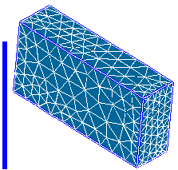

.. _borders_at_multi_connection_page:

***************************
Borders at multi-connection
***************************

This mesh quality control highlights segments according to the number of elements, faces and volumes, to which the segment belongs.

In this picture the borders at multi-connection are displayed in blue.

**See Also** a sample TUI Script of a :ref:`tui_borders_at_multiconnection` operation.

