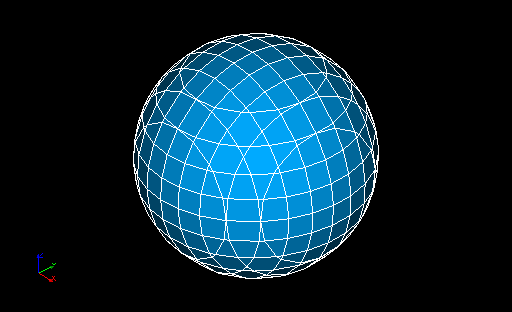
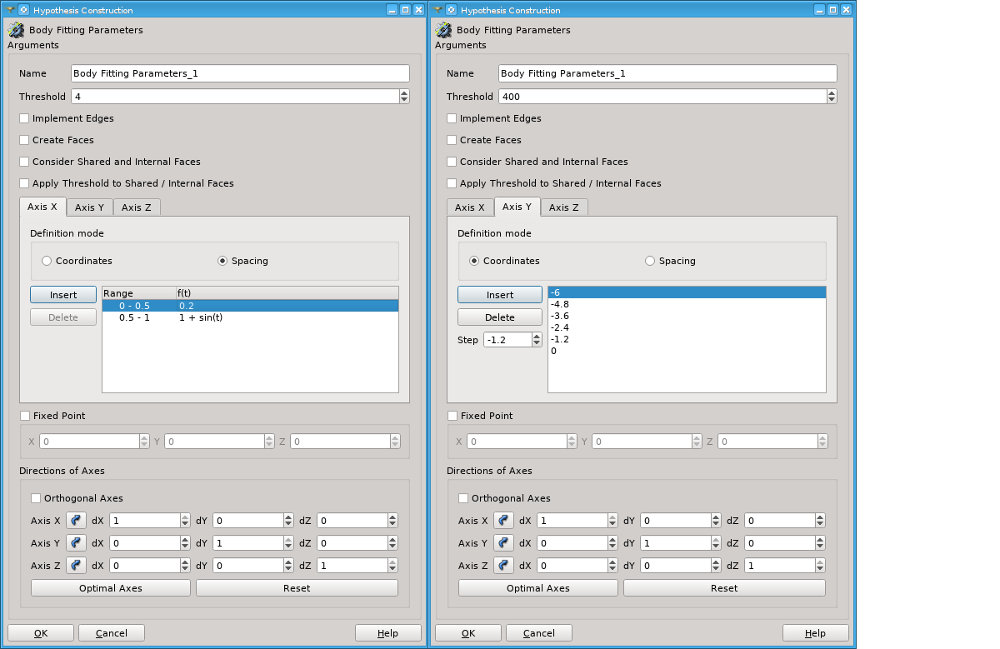

.. _cartesian_algo_page:

*********************************
Body Fitting 3D meshing algorithm
*********************************

Body Fitting algorithm generates hexahedrons of a Cartesian grid in
the internal part of geometry and polyhedrons and other types of
elements at the intersection of Cartesian cells with the geometrical
boundary.

.. centered::
	"A sphere meshed by Body Fitting algorithm"

The meshing algorithm is as follows.

#. Lines of a Cartesian structured grid defined by :ref:`cartesian_hyp_anchor` hypothesis are intersected with the geometry boundary, thus nodes lying on the boundary are found. This step also allows finding out for each node of the Cartesian grid if it is inside or outside the geometry. 
#. For each cell of the grid, check how many of its nodes are outside of the geometry boundary. Depending on a result of this check
#. skip a cell, if all its nodes are outside 
#. skip a cell, if it is too small according to **Size Threshold** parameter
#. add a hexahedron in the mesh, if all nodes are inside 
#. add a polyhedron or another cell type in the mesh, if some nodes are inside and some outside.  

To apply this algorithm when you define your mesh, select **Body Fitting** in the list of 3D algorithms and add **Body Fitting  Parameters** hypothesis. The following dialog will appear:

.. _cartesian_hyp_anchor:

Body Fitting Parameters hypothesis
##################################

.. centered::
	"Body Fitting Parameters hypothesis dialog"

This dialog allows to define

* **Name** of the algorithm. 
* Minimal size of a cell truncated by the geometry boundary. If the size of a truncated grid cell is **Threshold** times less than a initial cell size, then a mesh element is not created. 
* **Implement Edges** check-box activates incorporation of geometrical edges in the mesh.
  
	.. image:: ../images/cartesian_implement_edge.png 
		:align: center

	.. centered::
		"Implement Edges switched off to the left and on to the right"

* **Definition mode** allows choosing how Cartesian structured grid is defined. Location of nodes along each grid axis is defined individually:
    
	* You can specify the **Coordinates** of grid nodes. **Insert** button inserts a node at **Step** distance (negative or positive) from the selected node. **Delete** button removes the selected node. Double click on a coordinate in the list enables its edition. 
		.. note:: 
			that node coordinates are measured along directions of axes that can differ from the directions of the Global Coordinate System.
	* You can define the **Spacing** of a grid as an algebraic formula **f(t)** where *t* is a position along a grid axis normalized at [0.0,1.0]. **f(t)** must be non-negative at 0. <= *t* <= 1. The whole extent of geometry can be divided into ranges with their own spacing formulas to apply; a t varies between 0.0 and 1.0 within each **Range**. **Insert** button divides a selected range into two. **Delete** button adds the selected sub-range to the previous one. Double click on a range in the list enables edition of its right boundary. Double click on a function in the list enables its edition.
  
* **Fixed Point** group allows defining an exact location of a grid node in the direction defined by spacing. The following cases are possible:
   
	* If all three directions are defined by spacing, there will be a mesh node at the **Fixed Point**. 
	* If two directions are defined by spacing, there will be at least a link between mesh nodes passing through the **Fixed Point**. 
	* If only one direction is defined by spacing, there will be at least an element facet passing through the **Fixed Point**.
	* If no directions are defined by spacing, **Fixed Point** is disabled.
	
* **Directions of Axes** group allows setting the directions of grid axes.
   
	* If **Orthogonal Axes** check-box is activated the axes remain orthogonal during their modification. 
	* Selection buttons enable snapping corresponding axes to direction of a geometrical edge selected in the Object Browser. Edge direction is defined by coordinates of its end points.
	* **Optimal Axes** button runs an algorithm that tries to set the axes to maximize the number of generated hexahedra.
	* **Reset** button returns the axes in a default position parallel to the axes of the Global Coordinate System. 
  
  
 

**See Also** a sample TUI Script of a :ref:`tui_cartesian_algo`.

