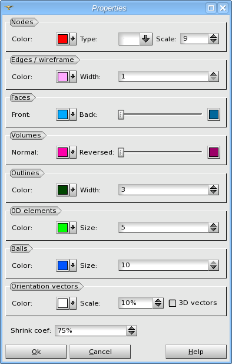

.. _colors_size_page:

**********
Properties
**********

Using this dialog you can customize different properties of the mesh visualization parameters.

The GUI elements in the "Properties" dialog box are grouped according to the entity types of mesh data. If some data entities are not present in the mesh object, the corresponding GUI elements are not shown.

*  **Nodes**:
	* **Color** - color of nodes.
	* **Type** and **Scale** - these options allow changing the nodes representation (see :ref:`point_marker_page` page for more details).
* **Edges / wireframe**:
	* **Color** - color of element borders in wireframe mode.
	* **Width** - width of lines (edges and borders of elements in wireframe mode).
* **Faces**:
	* **Front** - surface color of face elements (seen in shading mode).
	* **Back** - backside surface color of face elements. Use the slider to select this color generated on the base of the **Face** color by changing its brightness and saturation. 
* **Volumes**:
	* **Normal** - surface color of normal volume elements (seen in shading mode).
	* **Reversed** - surface color of volume elements. Use the slider to select this color generated on the base of the **Normal** color by changing its brightness and saturation. 
* **Outlines**:
	* **Color** - color of element borders in shading mode.
	* **Width** - width of outlines (borders of elements in shading mode).
* **0D elements**:
	* **Color** - color of 0D elements.
	* **Size** - size of 0D elements.
* **Balls**:
	* **Color** - color of discrete ball elements.
	* **Size** - size of discrete ball elements.
	* **Scale** - scale factor of discrete ball elements.
* **Orientation vectors**:
	* **Color** - color of orientation vectors.
	* **Scale** - size of orientation vectors.
	* **3D vectors** - allows to choose between 2D planar and 3D vectors.
* **Shrink coef.** - relative space of elements compared to gaps between them in shrink mode.

.. toctree::
   :hidden:

   point_marker.rst
