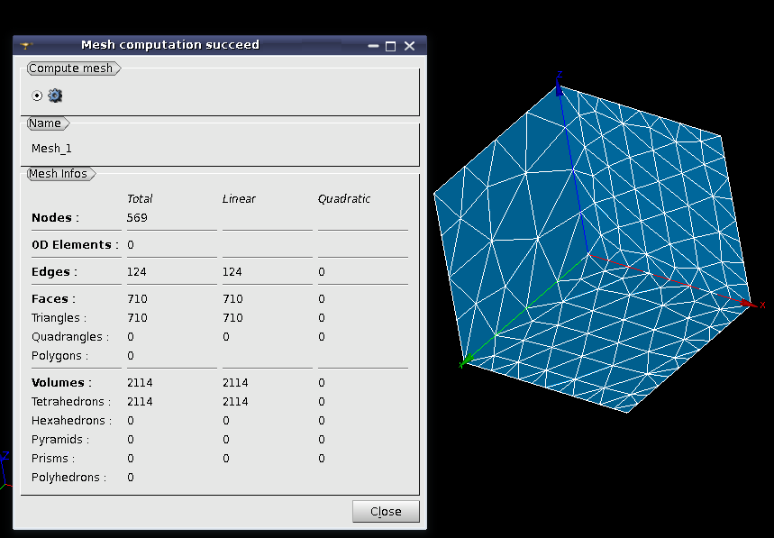
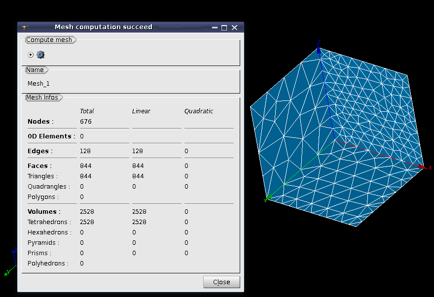
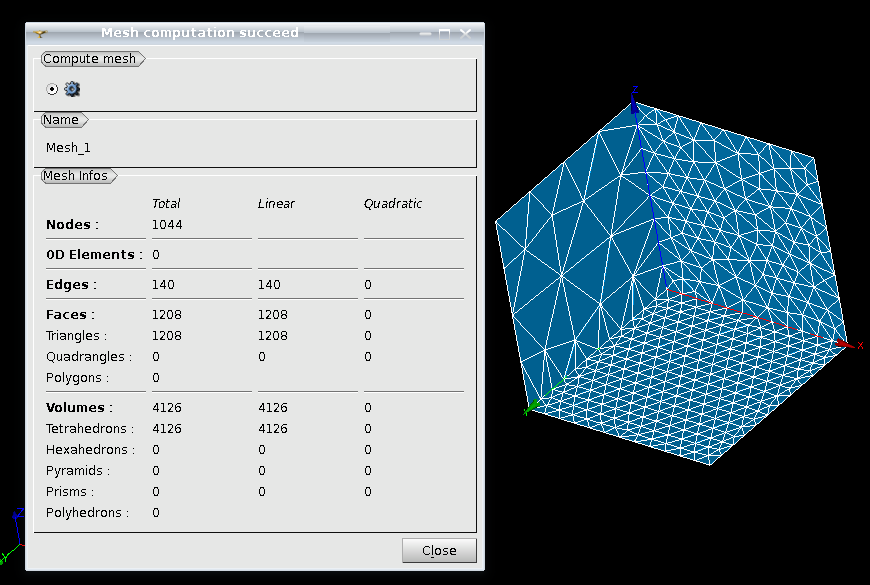
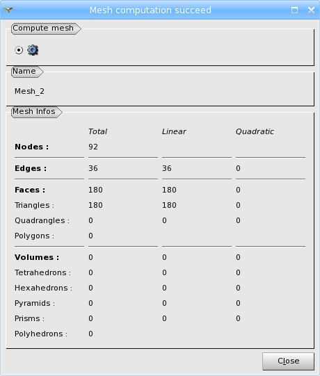
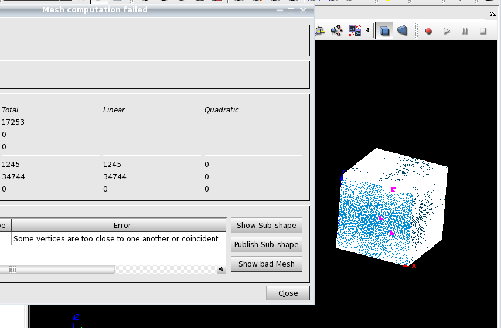

.. _constructing_meshes_page:

*******************
Constructing meshes
*******************

To create a mesh on geometry, it is necessary to create a mesh object by choosing

* a geometrical shape produced in the Geometry module (*main shape*);
* *meshing parameters*, including 

  * :ref:`meshing algorithms <basic_meshing_algos_page>` and
  * :ref:`hypotheses <about_hypo_page>` specifying constraints to be taken into account by the chosen meshing algorithms.

Then you can launch mesh generation by invoking :ref:`Compute <compute_anchor>` command.
The generated mesh will be automatically shown in the Viewer. You can
switch off automatic visualization or limit mesh size until which it is
automatically shown in :ref:`mesh_preferences_page` (*Automatic update* entry).

Read more about meshing parameters:

.. toctree::
	:maxdepth: 1

	basic_meshing_algos.rst
	about_hypo.rst

Mesh generation on the geometry is performed in the bottom-up
flow: nodes on vertices are created first, then edges are divided into
segments using nodes on vertices; the nodes of segments are then
used to mesh faces; then the nodes of faces are used to mesh
solids. This automatically assures the conformity of the mesh.

It is required to choose a meshing algorithm for every dimension of
sub-shapes up to the highest dimension to be generated. Note
that some algorithms generate elements of several dimensions, and
others of only one. It is not necessary to define meshing
parameters for all dimensions at once; you can start from 1D
meshing parameters only, compute the 1D mesh, then define 2D meshing
parameters and compute the 2D mesh (note that 1D mesh will not be
re-computed).

An algorithm of a certain dimension chosen at mesh creation is applied
to discretize every sub-shape of this dimension. It is possible to
specify a different algorithm or hypothesis to be applied to one or
a group of sub-shapes by creating a :ref:`sub-mesh <constructing_submeshes_page>`.
You can specify no algorithms at all at mesh object
creation and specify the meshing parameters on sub-meshes only; then
only the sub-shapes, for which an algorithm and a hypothesis (if any)
have been defined will be discretized.

Construction of a mesh on a geometry includes at least two (:ref:`mesh creation <create_mesh_anchor>` and :ref:`computing <compute_anchor>`) of the following steps:

* :ref:`create_mesh_anchor`, where you can specify meshing parameters to apply to all sub-shapes of the main shape.
* :ref:`Creation of sub-meshes <constructing_submeshes_page>`, (optional) where you can specify meshing parameters to apply to the selected sub-shapes.
* :ref:`evaluate_anchor` (optional) can be used to know an approximate number of elements before their actual generation.
* :ref:`preview_anchor` (optional) can be used to generate mesh of only lower dimension(s) in order to visually estimate it before full mesh generation, which can be much longer.
* :ref:`submesh_order_anchor` (optional) can be useful if there are concurrent sub-meshes defined.
* :ref:`compute_anchor` uses defined meshing parameters to generate mesh elements.
* :ref:`edit_anchor` (optional) can be used to :ref:`modify <modifying_meshes_page>` the mesh of a lower dimension before :ref:`computing <compute_anchor>` elements of an upper dimension.

.. _create_mesh_anchor:

Creation of a mesh object
#########################

To construct a mesh:

.. |sel| image:: ../images/image120.png

.. |edt| image:: ../images/image122.png

.. |prv| image:: ../images/mesh_precompute.png

#. Select a geometrical object for meshing.
#. In the **Mesh** menu select **Create Mesh** or click *"Create Mesh"* button |img| in the toolbar.

   The following dialog box will appear: 

	.. image:: ../images/createmesh-inv.png
		:align: center
  
#. To filter off irrelevant meshing algorithms, you can select **Mesh Type** in the corresponding list from **Any, Hexahedral, Tetrahedral, Triangular** and **Quadrilateral** (there can be less items for the geometry of lower dimensions). Selection of a mesh type hides all meshing algorithms that cannot generate elements of this type.

#. Apply :ref:`meshing algorithms <basic_meshing_algos_page>` and :ref:`hypotheses <about_hypo_page>` which will be used to compute this mesh.

   "Create mesh" dialog box contains several tab pages titled **3D**, **2D**, **1D** and **0D**. The title of each page reflects the dimension of the sub-shapes the algorithms listed on this page affect and the maximal dimension of elements the algorithms generate. For example, **3D** page lists the algorithms that affect 3D sub-shapes (solids) and generate 3D mesh elements (tetrahedra, hexahedra etc.)

   As soon as you have selected an algorithm, you can create a hypothesis (or select an already created one). A set of accessible hypotheses includes only the hypotheses that can be used by the selected algorithm.

   .. note::
      * Some page(s) can be disabled if the geometrical object does not include shapes (sub-shapes) of the corresponding dimension(s). For example, if the input object is a geometrical face, **3D** page is disabled.
      * Some algorithms affect the geometry of several dimensions, i.e. 1D+2D or 1D+2D+3D. If such an algorithm is selected, the dialog pages related to the corresponding lower dimensions are disabled.
      * **0D** page refers to 0D geometry (vertices) rather than to 0D elements. Mesh module does not provide algorithms that produce 0D elements. Currently **0D** page provides only one algorithm "Segments around vertex" that allows specifying the required size of mesh edges about the selected vertex (or vertices).

   For example, you need to mesh a 3D object.

   First, you can change a default name of your mesh in the **Name** box. Then check that the selected geometrical object indicated in **Geometry** field, is what you wish to mesh; if not, select the correct object in the Object Browser. Click "Select" button |sel| near **Geometry** field if the name of the object has not yet appeared in **Geometry** field.

   Now you can define 3D Algorithm and 3D Hypotheses, which will be applied to discretize the solids of your geometrical object using 3D elements. Click the *"Add Hypothesis"* button |add| to create  and add a hypothesis.

   Click the *"Plus"* button to enable adding more additional hypotheses.

   Click the *"Edit Hypothesis"* button |edt| to change the values for the current hypothesis.

   Most 2D and 3D algorithms can work without hypotheses using default meshing parameters. Some algorithms do not require any hypotheses. After selection of an algorithm "Hypothesis" field of the dialog can contain:
    
   * *\<Default\>* if the algorithm can work using default parameters.
   * *\<None\>* if the algorithm requires a hypothesis defining its parameters.
   * If the algorithm does not use hypotheses, this field is grayed.
    
   After selection of an algorithm **Add. Hypothesis** field can contain:
    
   * *\<None\>* if the algorithm can be tuned using an additional hypothesis.
   * If the algorithm does not use additional hypotheses, this field is grayed.
    

   Proceed in the same way with 2D and 1D Algorithms and Hypotheses that will be used to mesh faces and edges of your geometry. (Note that any object has edges, even if their existence is not apparent, for example, a sphere has 4 edges). Note that the choice of hypotheses and lower dimension algorithms depends on the higher dimension algorithm.

   If you wish you can select other algorithms and/or hypotheses for meshing some sub-shapes of your CAD model by :ref:`constructing_submeshes_page`.

   Some algorithms generate mesh of several dimensions, while others produce mesh of only one dimension. In the latter case there must be one Algorithm and zero or several Hypotheses for each dimension of your object, otherwise you will not get any mesh at all. Of course, if you wish to mesh a face, which is a 2D object, you do not need to define a 3D Algorithm and Hypotheses.

   In the **Object Browser** the structure of the new mesh is displayed as follows:

	.. image:: ../images/image88.jpg
		:align: center

   It contains: 
    
   * a mesh name (*Mesh_mechanic*);
   * a reference to the geometrical object on the basis of which the mesh has been constructed (*mechanic*); 
   * **Applied hypotheses** folder containing the references to the hypotheses chosen at the construction of the mesh;
   * **Applied algorithms** folder containing the references to the algorithms chosen at the construction of the mesh. 
   * **SubMeshes on Face** folder containing the sub-meshes defined on geometrical faces. There also can be folders for sub-meshes on vertices, edges, wires, shells, solids and compounds.
   * **Groups of Faces** folder containing the groups of mesh faces. There also can be folders for groups of nodes, edges, volumes 0D elements and balls.

   There is an alternative way to assign Algorithms and Hypotheses by clicking **Assign a set of hypotheses** button and selecting among pre-defined sets of algorithms and hypotheses. In addition to the built-in sets of hypotheses, it is possible to create custom sets by editing CustomMeshers.xml file located in the home directory. CustomMeshers.xml file must describe sets of hypotheses in the same way as ${SMESH_ROOT_DIR}/share/salome/resources/smesh/StdMeshers.xml file does (sets of hypotheses are enclosed between \<hypotheses-set-group\> tags). For example:
	::

		<?xml version='1.0' encoding='us-ascii'?>
		<!DOCTYPE meshers PUBLIC "" "desktop.dtd">
		<meshers>
		<hypotheses-set-group>
			<hypotheses-set name="My favorite hypotheses"
                        	hypos="AutomaticLength"
                        	algos="CompositeSegment_1D, Quadrangle_2D, GHS3D_3D"/>
		</hypotheses-set-group>
		</meshers>

   If the file contents are incorrect, there can be an error at activation of Mesh module: *"fatal parsing error: error triggered by consumer in line ..."*

	.. image:: ../images/hypo_sets.png
		:align: center

   .. centered::
      List of sets of hypotheses. Tag *[custom]* is automatically added to the sets defined by the user.

   .. note::
      * *"Automatic"* in the names of predefined sets of hypotheses does not actually mean that they are suitable for meshing any geometry.
      * The list of sets of hypotheses can be shorter than in the above image depending on the geometry dimension.
  

Consider trying a sample script for construction of a mesh from our :ref:`TUI Scripts <tui_creating_meshes_page>` section.

.. _evaluate_anchor:

Evaluating mesh size
####################

After the mesh object is created and all hypotheses are assigned and before :ref:`Compute <compute_anchor>` operation, it is possible to calculate the eventual mesh size. For this, select the mesh in the **Object Browser** and from the **Mesh** menu select **Evaluate**.
The result of evaluation will be displayed in the following information box: 

	.. image:: ../images/mesh_evaluation_succeed.png
		:align: center

.. _preview_anchor:

Previewing the mesh
###################

Before :ref:`the mesh computation <compute_anchor>`, it is also possible to see the mesh preview. This operation allows to incrementally compute the mesh, dimension by dimension, and to discard an unsatisfactory mesh.

For this, select the mesh in the Object Browser. From the **Mesh** menu select **Preview** or click "Preview" button |prv| in the toolbar or activate "Preview" item from the pop-up menu.

Select **1D mesh** or **2D mesh** preview mode in the Preview dialog. 

.. image:: ../images/preview_mesh_1D.png 
	:align: center

.. centered::
	1D mesh preview shows nodes computed on geometry edges

.. image:: ../images/preview_mesh_2D.png 
	:align: center

.. centered::
	2D mesh preview shows edge mesh elements, computed on geometry faces

**Compute** button computes the whole mesh.

When the Preview dialog is closed, the question about the storage of temporarily created mesh elements appears:

.. image:: ../images/preview_tmp_data.png
	:align: center

These elements can be kept in the mesh.

.. _submesh_order_anchor:

Changing sub-mesh priority
##########################

If the mesh contains concurrent :ref:`sub-meshes <constructing_submeshes_page>`, it is possible to change the priority of their computation, i.e. to change the priority of applying algorithms to the shared sub-shapes of the Mesh shape.

*To change sub-mesh priority:*

Choose **Change sub-mesh priority** from the **Mesh** menu or a pop-up menu. The opened dialog shows a list of sub-meshes in the order of their priority. 

There is an example of sub-mesh order modifications taking a Mesh created on a Box shape. The main Mesh object:

* *1D* **Wire discretisation** with **Number of Segments** = 20
* *2D* **Triangle: Mefisto** with Hypothesis **Max Element Area**
  

The first sub-mesh **Submesh_1** created on **Face_1** is:

* *1D* **Wire discretisation** with **Number of Segments** = 4
* *2D* **Triangle: Mefisto** with Hypothesis **MaxElementArea** = 1200

The second sub-mesh **Submesh_2** created on **Face_2** is:

* *1D* **Wire discretisation** with **Number of Segments** = 8
* *2D* **Triangle: Mefisto** with Hypothesis **MaxElementArea** = 1200

And the last sub-mesh **Submesh_3** created on **Face_3** is:

* *1D* **Wire discretisation** with **Number of Segments** = 12
* *2D* **Triangle: Mefisto** with Hypothesis **MaxElementArea** = 1200

The sub-meshes become concurrent if they share sub-shapes that can be meshed with different algorithms (or different hypotheses). In the example, we have three sub-meshes with concurrent algorithms, because they have different hypotheses.

The first mesh computation is made with:

.. centered::
	Mesh order SubMesh_1, SubMesh_2, SubMesh_3

.. centered::
	Result mesh with order SubMesh_1, SubMesh_2, SubMesh_3

The next mesh computation is made with:

.. centered::
	Mesh order SubMesh_2, SubMesh_1, SubMesh_3

.. centered::
	Result mesh with order SubMesh_2, SubMesh_1, SubMesh_3

And the last mesh computation is made with:

.. centered::
	Mesh order SubMesh_3, SubMesh_2, SubMesh_1
	

.. centered::
	Result mesh with order SubMesh_3, SubMesh_2, SubMesh_1

As we can see, each mesh computation has a different number of result
elements and a different mesh discretization on the shared edges (the edges 
that are shared between **Face_1**, **Face_2** and **Face_3**)

Additionally, sub-mesh priority (the order of applied algorithms) can
be modified not only in a separate dialog box, but also in
the **Preview**. This helps to preview different mesh results,
modifying the order of sub-meshes. 

.. centered::
	Preview with sub-mesh priority list box

If there are no concurrent sub-meshes under the Mesh object, the user
will see the following information.

.. centered::
	No concurrent submeshes detected

.. _compute_anchor:

Computing the mesh
##################

It is equally possible to skip  :ref:`Evaluation <evaluate_anchor>`
and :ref:`Preview <preview_anchor>` and to **Compute** the mesh after
the hypotheses are assigned. For this, select your mesh in
the Object Browser. From the **Mesh** menu or the context menu
select **Compute** or click *"Compute"* button |cmp| of the toolbar.

After the mesh computation finishes, the Mesh Computation information
box appears. If you close this box and click "Compute" button again,
without previously changing meshing parameters, the mesh will NOT be
re-computed and the Mesh Computation information box will be shown
with the same contents. (To fully re-compute the mesh, invoke 
:ref:`clear_mesh_anchor` command before). 

.. _meshing_result_anchor:

If the mesh computation has been a success, the box shows information on the number of entities of different types in the mesh.

.. _meshing_failed_anchor:

If the mesh computation has failed, the information about the cause of the failure is provided in **Errors** table.

After you select an error in **Errors** table, **Show Sub-shape** button allows
visualizing in magenta the geometrical entity meshing of which failed
(Name of this entity or its ID and type is shown in *Sub-shape* column).

.. centered::
	3D algorithm failed to compute mesh on a box shown using **Show Sub-shape** button

**Publish Sub-shape** button publishes the sub-shape, whose meshing
has failed, in the Geometry component as a child of the main shape, which
allows analyzing the problematic geometry and creating a sub-mesh on it in
order to locally tune the hypotheses.

If the failure is caused by an invalid input mesh and the algorithm has
found which mesh entities are bad, **Show bad Mesh** 
button appears in the dialog. Clicked, it shows the bad mesh entities in
the Viewer in magenta. Sometimes the shown mesh entities are too small
or/and hidden by other mesh elements. They can be seen after
switching the mesh to Wireframe visualization mode or switching off
the visualization of faces and volumes (if any).

**Bad Mesh to Group** button creates groups of bad mesh entities to facilitate their analysis.

Edges bounding a hole in the surface are shown in magenta using **Show bad Mesh** button

.. note::
	Mesh Computation Information box does not appear if you set :ref:`Mesh computation/Show a computation result notification <show_comp_result_pref>` preference to the "Never" value. This option gives the possibility to control mesh computation reporting. There are the following possibilities: always show the information box, show only if an error occurs or never. By default, the information box is always shown after mesh computation operation.

.. _edit_anchor:

Editing the mesh
################

It is possible to :ref:`edit the mesh <modifying_meshes_page>` of a 
lower dimension before generation of the mesh of a higher dimension.

For example you can generate a 2D mesh, modify it using e.g. :ref:`Pattern mapping <pattern_mapping_page>`, and then generate a 3D mesh basing on the modified 2D mesh. The workflow is as follows:

* Define 1D and 2D meshing algorithms.
* Compute the mesh. 2D mesh is generated.
* Apply :ref:`Pattern mapping <pattern_mapping_page>`.
* Define 3D meshing algorithms without modifying 1D and 2D algorithms and hypotheses.
* Compute the mesh. 3D mesh is generated basing on a modified 2D mesh.

.. note::
   Nodes and elements added :ref:`manually <adding_nodes_and_elements_page>` cannot be used in this workflow because the manually created entities are not attached to any geometry and thus (usually) cannot be found by the mesher paving a geometry.

**See Also** a sample TUI Script demonstrates the possibility of :ref:`tui_editing_while_meshing`.

