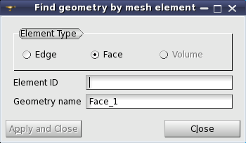

.. _constructing_submeshes_page: 

***********************
Constructing sub-meshes
***********************

.. contents:: `Table of contents`

What the sub-mesh is for
########################

By purpose, the sub-mesh is an object used to assign to a sub-shape
different meshing parameters than those assigned to the main shape.

Structurally, the sub-mesh is a mesh on a certain sub-shape, or a group of
sub-shapes, possibly generated using different meshing algorithms
and/or hypotheses than those used to generate the mesh on other
sub-shapes. Elements generated on a sub-shape can be retrieved without
explicit creation of a sub-mesh by creating a *Group on Geometry* using
:ref:`Create Groups from Geometry <create_groups_from_geometry_page>` dialog.

Creation of a sub-mesh allows to control individually meshing of a
certain sub-shape, thus to get a locally coarser or finer mesh, to get
elements of different types in the same mesh, etc.

A sub-mesh can be meshed individually. To achieve this, select a
sub-mesh and either invoke **Compute Sub-mesh** vai the contextual
menu in the Object Browser or invoke **Mesh > Compute** menu.

.. _submesh_shape_section: 

How to get a sub-shape for sub-mesh construction
################################################

A sub-shape to create a sub-mesh on should be retrieved from the main shape
in one of the following ways: 

* In Geometry module, via **New Entity > Explode** menu.
* In Geometry module, by creation of a group (**New Entity > Group > Create Group** menu). 
* In Mesh module, by :ref:`selecting a mesh element <subshape_by_mesh_elem>` generated on a sub-shape of interest. This way is accessible if the mesh is already computed. 
* In Mesh module, by clicking **Publish Sub-shape** button in a dialog showing :ref:`meshing errors <meshing_failed_anchor>`. 

.. :submesh_priority: 

How hypotheses are selected among sub-meshes
############################################

Internally, definition of meshing parameters to apply for
discretization of a certain sub-shape, for example an edge of a
compound of solids, starts from searching an algorithm, 1D as for the
edge. The following sub-shapes are sequentially checked for presence
of a sub-mesh where 1D algorithm is assigned:

* the **edge** itself
* **groups of edges** containing the edge, if any
* **wires** sharing the edge
* **faces** sharing the edge
* **groups of faces** sharing the edge, if any
* **shells** sharing the edge
* **solids** sharing the edge
* **groups of solids** sharing the edge, if any
* the **main shape**

(This sequence of sub-shapes defines the priority of sub-meshes. Thus more
local, i.e. assigned to sub-shape of lower dimension, algorithms and
hypotheses have higher priority during the search of hypotheses to
apply.)

As soon as a 1D algorithm is found, the search stops and the same
sequence of sub-shapes is checked to find the main and additional 1D
hypotheses, which can be taken into account by the found 1D algorithm. 

The multi-dimensional algorithms have a higher priority than
uni-dimensional ones if they are assigned to sub-meshes of the
same priority.

If meshing parameters are defined on sub-meshes of the same priority,
for example, different 1D hypotheses are assigned to two faces sharing
an edge, the hypothesis assigned to a sub-shape with a lower ID will
be used for meshing. You can :ref:`change <submesh_order_anchor>` mutual
priority of such concurrent sub-meshes. 

.. _submesh_definition: 

How to construct a sub-mesh
###########################

Construction of a sub-mesh consists of:

* Selecting a mesh which will encapsulate the sub-mesh.
* Selecting a sub-shape for meshing.
* Selecting a :ref:`meshing algorithm <basic_meshing_algos_page>` which will be used for discretization of this sub-shape.
* Creating or selecting one or several :ref:`hypotheses <about_hypo_page>`.

*To construct a sub-mesh:*

From the **Mesh** menu select **Create Sub-mesh** or click *"Create Sum-mesh"* button |img| in the toolbar.

The following dialog box will appear:

	.. image:: ../images/createmesh-inv2.png
		:align: center

It allows to define the **Name**, the parent **Mesh** and the **Geometry** (e.g. a face if the parent mesh has been built on box) of the sub-mesh. You can define meshing algorithms and hypotheses in the same way as in :ref:`Create mesh <constructing_meshes_page>` dialog. 

Later you can change the applied hypotheses or their parameters in :ref:`Edit mesh/sub-mesh <editing_meshes_page>` dialog. Mesh entities generated using changed hypotheses are automatically removed.

.. _subshape_by_mesh_elem:

If the parent mesh is already computed, then you can define the **Geometry** by picking mesh elements computed on a sub-shape of interest in the 3D Viewer, i.e. you do not have to extract this sub-shape in Geometry module beforehand. To start element selection, press *Selection* button to the right of **Geometry** label. If this button is already down, then click it to release and then click it again. The following pop-up menu allowing to choose a way of geometry definition will appear.

**Direct geometry selection** enables selecting the sub-shape in the Objec Browser.
**Find geometry by mesh element selection** activates the following dialog.

In this dialog, **Element Type** defines a kind of element to pick in the Viewer. Instead of picking an element in the Viewer, you can type its ID in **Element ID** field. **Geometry name** field allows defining a name of the sub-shape, with which the sub-shape will appear in the Object Browser (if not yet there).

.. _submesh_tree:

Sub-mesh in the Object Browser
##############################

In the Object Browser the structure of the new sub-mesh will be displayed as follows:

	.. image:: ../images/image10.jpg
		:align: center

It contains:

* a sub-mesh name (*SubMeshFace1*)
* a reference to the geometrical object on the basis of which the sub-mesh has been constructed (*Cylindrical Face_1*);
* *Applied hypotheses* folder containing references to hypotheses assigned to the sub-mesh;
* *Applied algorithms* folder containing references to algorithms assigned to the sub-mesh.

**See Also** a sample TUI Script of a :ref:`tui_construction_submesh` operation.

