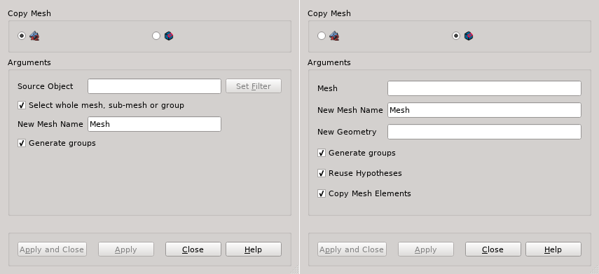

.. _copy_mesh_page:

*********
Copy Mesh
*********

A mesh can be created by copying a part of or the whole other mesh. There are two modes of the operation:

* copy mesh elements only;
* copy mesh definition to another geometry. This mode can be used only if the source mesh is based on geometry. It is supposed that the new geometry is a modified geometry of the source mesh.

*To make a copy of a mesh:*

From the contextual menu in the Object Browser of from the **Mesh** menu select **Copy Mesh** or click *"Copy Mesh"* button |img| in the toolbar.

The following dialog box will appear:

In the dialog:

* select the mode of the operation.
* specify the part of mesh to copy:

  * **Select whole mesh, sub-mesh or group** by mouse activating this checkbox; or
  * choose mesh elements with the mouse in the 3D Viewer. It is possible to select a whole area with a mouse frame; or 
  * input the **Source Element IDs** directly in this field. The selected elements will be highlighted in the viewer; or
  * apply Filters. **Set filter** button allows to apply a filter to the selection of elements. See more about filters in the :ref:`selection_filter_library_page` page.

* specify the **New Mesh Name**;
* select the **New Geometry**;
* specify the conditions of copying:

  * activate **Generate groups** check-box to copy the groups of the source mesh to the newly created mesh. In the mode of copying to new geometry, standalone groups are copied only if **Copy Mesh Elements** is activated.
  * activate **Reuse hypotheses** check-box to use hypotheses applied to the source mesh in the new mesh. Hypotheses having parameters defined as sub-shapes will be copied independently of this check-box state.
  * activate **Copy Mesh Element** to copy mesh elements of sub-shapes that are not modified.

* Click **Apply** or **Apply and Close** button to confirm the operation.

---------------------------------------------------
Limitations of copying the mesh to the new geometry
---------------------------------------------------

It can happen that a sub-shape used to define a sub-mesh, group or hypotheses is not found in the new geometry. In this case a new object depending on the not found sub-shape is marked with red color in the Object Browser in order to allow identifying such objects and to fix them, either by modifying their definition or by removing. If a depending object is a group on geometry, a standalone group is created instead. You can't transform it to a group on geometry, it can only be removed and re-created anew.

Empty standalone groups are not constructed.

**See Also** a sample script of :ref:`tui_copy_mesh`.

