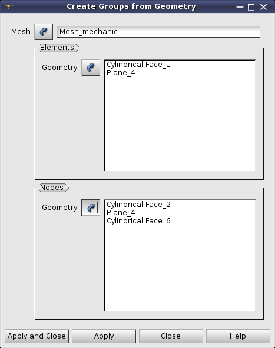

.. _create_groups_from_geometry_page:

***************************
Create Groups from Geometry
***************************

This operation allows creating groups on geometry on all selected shapes. Only the main shape of the mesh and its sub-shapes can be selected.

The type of each new group is defined automatically by the nature of the **Geometry**.
The group names will be the same as the names of geometrical objects.

.. warning:: It's impossible to create a group of **0D elements** or **ball elements** with this operation. For this, it is necessary to use :ref:`creating_groups_page` operation. 

To use this operation, select in the **Mesh** menu or in the contextual menu in the Object browser **Create Groups from Geometry** item.

In this dialog **Elements** group contains a list of shapes, on which  groups of elements will be created; **Nodes** group contains a list of shapes, on which groups of nodes will be created.

