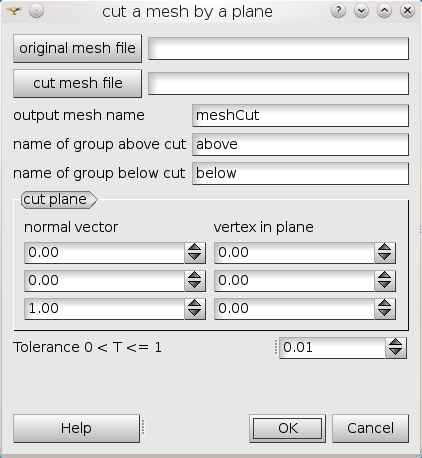

.. _cut_mesh_by_plane_page:

*********************************
Cut a tetrahedron mesh by a plane
*********************************

MeshCut works only with MED files and produces MED files, and is a standalone program. It can be used either directly from a command shell outside SALOME, or with a GUI interface in SMESH, provided in a python plugin that needs to be installed in your SALOME application.

MeshCut allows to cut a mesh constituted of linear tetrahedrons by a plane.
The tetrahedrons intersected by the plane are cut and replaced by elements of various types, (tetrahedron, pyramid, pentahedron).

.. _meshcut_standalone:

Using MeshCut as a standalone program, outside SALOME
#####################################################

MeshCut is a standalone program, reading and producing med files.                

Syntax::

	MeshCut input.med output.med resuMeshName aboveGroup belowGroup nx ny nz px py pz T

where::

	input.med = name of the original mesh file in med format
	output.med = name of the result mesh file in med format 
	resuMeshName = name of the result mesh                    
	aboveGroup = name of the group of volumes above the cut plane 
	belowGroups = name of the group of volumes below the cut plane 
	nx ny nz = vector normal to the cut plane                       
	px py pz = a point of the cut plane                              
	T = 0 < T < 1 : vertices of a tetrahedron are considered as belonging to the cut plane if their distance from the plane is inferior to L*T,
	where L is the mean edge size of the tetrahedron   

.. _meshcut_plugin:

Using MeshCut inside SALOME
###########################

When the MeshCut plugin is installed, it can be found in the Mesh menu, sub-menu SMESH_plugins.
If the plugin is not installed, the file meshcut_plugin.py is in SMESH installation in  subdirectory 
*bin/salome/meshcut_plugin.py*.

If there are already plugins defined in a smesh_plugins.py file, this file should be added at the end. If not, copied as 
*${HOME}/Plugins/smesh_plugins.py* or *${APPLI}/Plugins/smesh_plugins.py* or in *${PLUGINPATH}* directory.
 
From the Mesh menu, sub-menu SMESH_plugins, choose **"MeshCut"** item
The following dialog box will appear:

.. centered::
	"MeshCut Plugin dialog box"

See above for the meaning of the parameters. 

