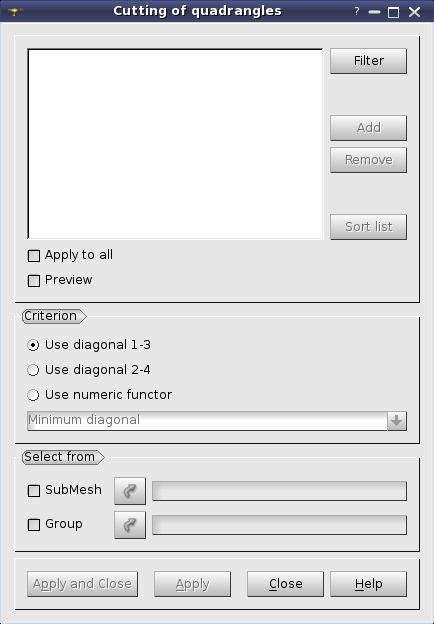

.. _cutting_quadrangles_page:

*******************
Cutting quadrangles
*******************

This operation allows cutting one or several quadrangle elements into two or four triangles.

**To cut quadrangles:**

1. Select a mesh (and display it in the 3D Viewer if you are going to pick elements by mouse).
2. In the **Modification** menu select the **Cutting of quadrangles** item or click **"Cutting of quadrangles"** button in the toolbar.

.. centered::
	**"Cutting of quadrangles" button**

The following dialog box will appear:

* The main list contains the list of quadrangles selected for cutting. You can click on a quadrangle in the 3D viewer and it will be highlighted (lock Shift keyboard button to select several quadrangles): 
	* Click **Add** button and the ID of this quadrangle will be added to the list. 
	* To remove a selected element or elements from the list click **Remove** button. 
	* **Sort list** button allows sorting the list of IDs. 
	* **Filter** button allows applying a definite :ref:`filtering_elements` "filter" to the selection of quadrangles.
* **Apply to all** check box allows cutting all quadrangles of the selected mesh.
* **Preview** provides a preview of cutting in the viewer. It is disabled for **Cut into 4 triangles** as this cutting way implies no ambiguity.
* **Criterion** defines the way of cutting:
	* **Cut into 4 triangles** allows cutting a quadrangle into four triangles by inserting a new node at the center of the quadrangle. The other options allow cutting a quadrangle into two triangles by connecting the nodes of a diagonal.
	* **Use diagonal 1-3** and **Use diagonal 2-4** allow specifying the opposite corners, which will be connected to form two new triangles.
	* **Use numeric functor** allows selecting in the field below a quality metric, which will be optimized when choosing a diagonal for cutting a quadrangle: 
		* **Minimum diagonal** cuts by the shortest diagonal.
		* **Aspect Ratio** cuts by the diagonal splitting the quadrangle into triangles with :ref:`aspect_ratio_page` "Aspect Ratio" closer to 1
		* **Minimum Angle** cuts by the diagonal splitting the quadrangle into triangles with :ref:`minimum_angle_page` "Minimum Angle" closer to 60 degrees.
		* **Skew** cuts by the diagonal splitting the quadrangle into triangles with :ref:`skew_page` "Skew" closer to 0.0 degrees.
* **Select from** allows choosing a sub-mesh or an existing group, whose quadrangle elements then can be added to the main list.

3. Click the **Apply** or **Apply and Close** button to confirm the operation.

.. centered::
	"The chosen quadrangular element"

|

.. centered::
	"Two resulting triangular elements"

**See Also** a sample TUI Script of a :ref:`tui_cutting_quadrangles` operation.  

