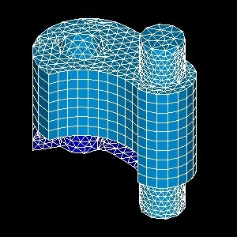
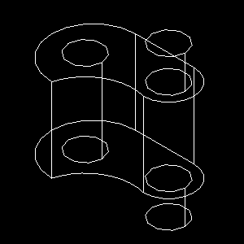
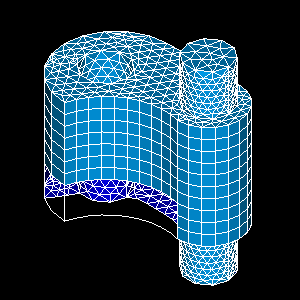
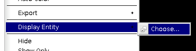
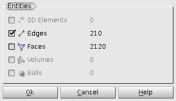

.. _display_entity_page:

**************
Display Entity
**************

In this submenu you can choose to display only volumes, faces or edges or combine them.

.. centered::
	Only Faces

.. centered::
	Only Edges

.. centered::
	Edges + Faces

If the mesh contains a lot of elements, select **Choose...** item, 

.. centered::
	Item to call 'Display Entity' dialog box

and **Display Entity** dialog box will provide a way to display only some entities at the first display instead of displaying all entities, which can take a long time.

.. centered::
	 'Display Entity' dialog allows to select entities before displaying

This menu item is available from the context menu in both Object browser and 3D viewer.
